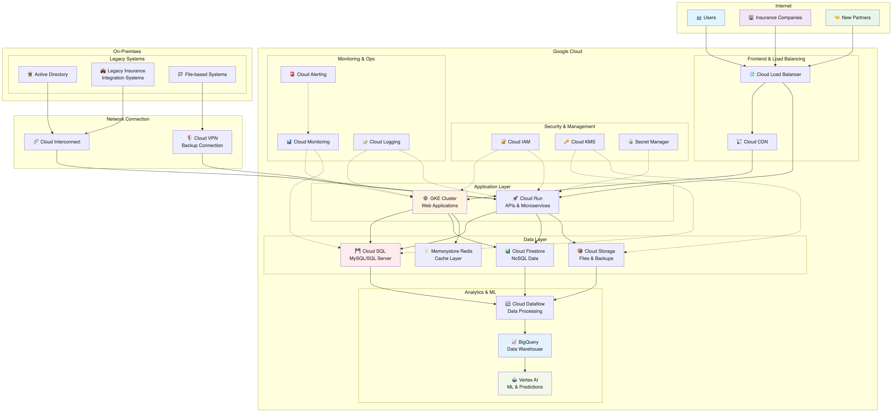
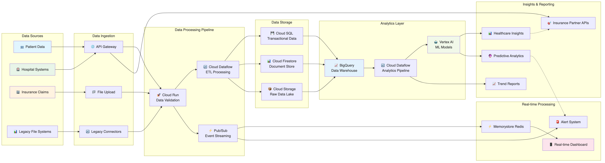
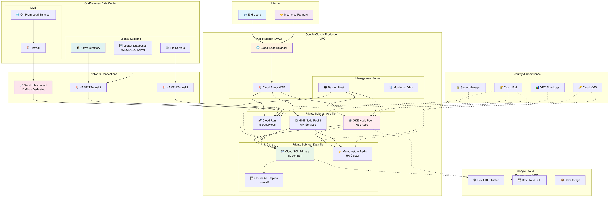

# EHR Healthcare アーキテクチャ推奨案

## 概要

EHR Healthcare の要件に基づいた Google Cloud アーキテクチャ設計案です。医療業界の法令遵守、高可用性（99.9%以上）、スケーラビリティ、セキュリティを重視した構成を提案します。

## アーキテクチャ概要

### 全体構成

- **マルチリージョン構成**: グローバル展開とレイテンシ低減のため
- **ハイブリッド構成**: オンプレミスのレガシーシステムとの連携
- **マイクロサービス アーキテクチャ**: コンテナベースアプリケーションの管理



上図は EHR Healthcare の全体アーキテクチャを示しています。Google Cloud の各サービスを活用したマルチリージョン・ハイブリッド構成により、高可用性とスケーラビリティを実現しています。

## 推奨 Google Cloud サービス

### 1. コンピューティング・コンテナ管理

#### Google Kubernetes Engine (GKE)

- **用途**: コンテナベース顧客向けアプリケーションの実行
- **構成**:
  - Autopilot モード採用で管理負荷軽減
  - マルチゾーン構成で高可用性確保
  - ワークロード Identity 有効化
- **利点**: 自動スケーリング、セキュリティ強化、運用効率化

#### Cloud Run

- **用途**: サーバーレス API とマイクロサービス
- **構成**:
  - 新規保険会社オンボーディング API
  - レポート生成サービス
  - データ処理パイプライン

### 2. データベース・ストレージ

#### Cloud SQL

- **用途**: MySQL と SQL Server のマネージド移行
- **構成**:
  - Multi-AZ 構成で高可用性
  - 自動バックアップと Point-in-Time Recovery
  - 暗号化（保存時・転送時）
- **利点**: 既存DBからの移行が容易、HIPAA準拠

#### Cloud Firestore

- **用途**: MongoDB の置き換え（NoSQL）
- **構成**:
  - マルチリージョン構成
  - セキュリティルール設定
- **利点**: リアルタイム同期、自動スケーリング

#### Memorystore for Redis

- **用途**: Redis キャッシュの代替
- **構成**:
  - HA構成
  - VPC内配置
- **利点**: 低レイテンシ、高可用性

#### Cloud Storage

- **用途**: ファイルベースデータと長期保存
- **構成**:
  - Standard クラス（アクティブデータ）
  - Nearline/Coldline（アーカイブ）
  - Lifecycle ポリシー設定

### 3. ネットワーキング・接続

#### Cloud Interconnect

- **用途**: オンプレミスとの高速・安全な接続
- **構成**:
  - Dedicated Interconnect または Partner Interconnect
  - 冗長化構成
- **利点**: 低レイテンシ、高帯域幅、安定性

#### Cloud VPN

- **用途**: バックアップ接続とリモートアクセス
- **構成**:
  - HA VPN 構成
  - 複数トンネル設定

#### Cloud Load Balancing

- **用途**: グローバル負荷分散
- **構成**:
  - HTTPS ロードバランサ
  - SSL証明書管理
  - CDN統合

### 4. データ分析・AI/ML

#### BigQuery

- **用途**: データウェアハウス・分析
- **構成**:
  - 医療動向分析
  - 保険業界レポート生成
  - リアルタイムストリーミング

#### Cloud Dataflow

- **用途**: データパイプライン処理
- **構成**:
  - バッチ・ストリーミング処理
  - データ変換・清浄化



上図は EHR Healthcare のデータフローを詳細に示しています。オンプレミスからクラウドへのデータ取り込み、変換、分析、配信までの一連のプロセスを可視化しています。

#### Vertex AI

- **用途**: 機械学習・予測モデル
- **構成**:
  - 医療動向予測
  - 異常検知
  - 自動化されたMLパイプライン

### 5. セキュリティ・IAM

#### Cloud IAM

- **用途**: アクセス制御・権限管理
- **構成**:
  - 最小権限の原則
  - カスタムロール定義
  - 条件付きアクセス

#### Cloud Identity

- **用途**: Microsoft AD との統合
- **構成**:
  - Google Cloud Directory Sync
  - SSO設定
  - MFA強制

#### Cloud KMS

- **用途**: 暗号鍵管理
- **構成**:
  - Customer-managed encryption keys (CMEK)
  - 定期的なキーローテーション

#### Secret Manager

- **用途**: API キーと秘密情報管理
- **構成**:
  - 自動ローテーション
  - アクセス監査

### 6. モニタリング・ロギング

#### Cloud Monitoring

- **用途**: システムパフォーマンス監視
- **構成**:
  - カスタムダッシュボード
  - SLI/SLO設定
  - 異常検知

#### Cloud Logging

- **用途**: 集約ログ管理
- **構成**:
  - 構造化ログ
  - ログベースのメトリクス
  - 長期保存

#### Cloud Alerting

- **用途**: プロアクティブ アラート
- **構成**:
  - スマートアラート（重複排除）
  - 多様な通知チャネル
  - エスカレーション設定

### 7. CI/CD・DevOps

#### Cloud Build

- **用途**: 継続的インテグレーション
- **構成**:
  - 自動ビルド・テスト
  - セキュリティスキャン統合

#### Artifact Registry

- **用途**: コンテナイメージ管理
- **構成**:
  - 脆弱性スキャン
  - アクセス制御

#### Cloud Deploy

- **用途**: 継続的デプロイ
- **構成**:
  - カナリアデプロイ
  - ロールバック機能

## ネットワーク設計

### VPC 構成

```
Production VPC
├── Public Subnet (Load Balancer)
├── Private Subnet (GKE Nodes)
├── Database Subnet (Cloud SQL)
└── Management Subnet (Bastion Hosts)

Development VPC
├── Dev Environment
└── Test Environment
```



上図は EHR Healthcare のネットワーク構成を詳細に示しています。プロダクション環境と開発環境の VPC 分離、オンプレミスとの接続、セキュリティ境界の設定を含む包括的なネットワークアーキテクチャです。

### セキュリティ

- **Firewall Rules**: 最小限のアクセス許可
- **Private Google Access**: インターネット経由なしでGoogleサービス利用
- **VPC Service Controls**: データ境界保護

## コンプライアンス・セキュリティ対策

### HIPAA 準拠

- Business Associate Agreement (BAA) 対応サービス利用
- データ暗号化（保存時・転送時）
- アクセスログ・監査証跡

### データ保護

- **暗号化**: Cloud KMS による鍵管理
- **アクセス制御**: IAM + VPC Service Controls
- **データ分離**: プロジェクト・環境分離

## 高可用性・災害復旧

### 可用性戦略

- **マルチゾーン構成**: 99.9%以上の可用性実現
- **自動フェイルオーバー**: Cloud SQL, GKE
- **ヘルスチェック**: 自動復旧

### バックアップ戦略

- **自動バックアップ**: Cloud SQL（日次）
- **レプリケーション**: Cross-region replica
- **Point-in-Time Recovery**: RPO 5分以内

## 移行戦略

### フェーズ1: インフラ基盤構築

1. VPC・ネットワーク設定
2. Cloud Interconnect 接続
3. IAM・セキュリティ設定

### フェーズ2: データベース移行

1. Cloud SQL への段階的移行
2. データ同期・検証
3. アプリケーション接続切替

### フェーズ3: アプリケーション移行

1. コンテナ化済みアプリのGKE移行
2. レガシーアプリの段階的移行
3. モニタリング・アラート設定

### フェーズ4: 最適化・拡張

1. 自動スケーリング設定
2. CI/CD パイプライン構築
3. ML/分析機能追加

## コスト最適化

### リソース管理

- **Committed Use Discounts**: 長期契約割引
- **Preemptible Instances**: 開発・テスト環境
- **Rightsizing**: リソース使用量監視・調整

### 自動化

- **Auto Scaling**: 需要に応じたリソース調整
- **Scheduled Scaling**: 定期的なスケールダウン
- **Lifecycle Policies**: ストレージクラス自動移行

## 監視・運用

### SLI/SLO 設定

- **可用性**: 99.9% (年間ダウンタイム 8.77時間以内)
- **レスポンス時間**: 95%tile で 500ms以内
- **エラー率**: 0.1%以下

### 運用自動化

- **自動復旧**: ヘルスチェック・自動再起動
- **Capacity Planning**: 使用量予測・事前拡張
- **Security Scanning**: 継続的セキュリティ監視

この設計により、EHR Healthcare は高可用性、スケーラビリティ、セキュリティ、コンプライアンスの要件を満たしながら、運用効率とコスト最適化を実現できます。
