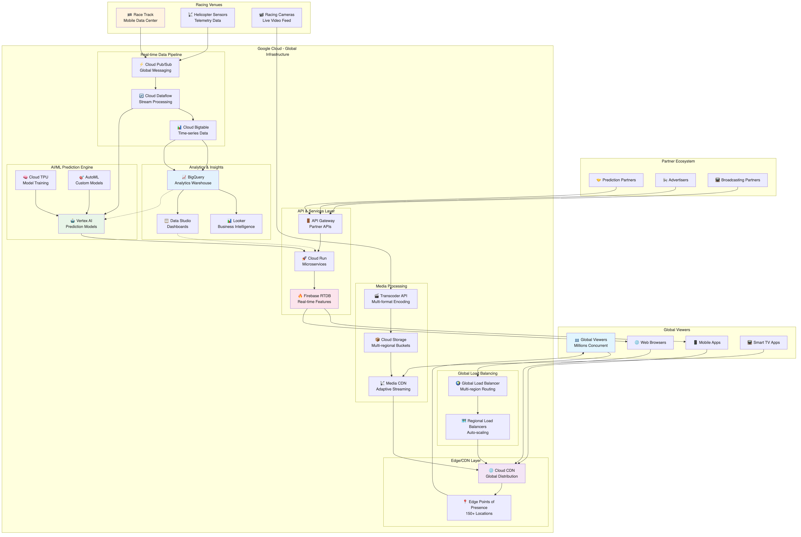

# Helicopter Racing League アーキテクチャ推奨案

## 概要

Helicopter Racing League (HRL) の要件に基づいた Google Cloud アーキテクチャ設計案です。グローバル動画配信、リアルタイム AI/ML 予測、低レイテンシ、スケーラビリティを重視した構成を提案します。

## アーキテクチャ概要

### 全体構成

- **グローバル マルチリージョン構成**: 世界規模での低レイテンシ配信
- **エッジコンピューティング**: レース場でのリアルタイム処理
- **イベントドリブン アーキテクチャ**: リアルタイムデータ処理・予測
- **マイクロサービス構成**: 独立したスケーリングと管理



上図は Helicopter Racing League の全体アーキテクチャを示しています。レース場からのリアルタイムデータ収集、AI/ML による予測処理、グローバル動画配信まで、エンドツーエンドのデータフローを可視化しています。

## 推奨 Google Cloud サービス

### 1. 動画配信・メディア処理

#### Cloud CDN

- **用途**: グローバル動画配信・低レイテンシ実現
- **構成**:
  - グローバル エッジロケーション活用
  - Cache-Control 設定最適化
  - 帯域幅制御とコスト最適化
- **利点**: 世界中のユーザーへの高速配信、トラフィック負荷軽減

#### Cloud Storage

- **用途**: 動画コンテンツ保存・配信
- **構成**:
  - Multi-regional buckets（グローバル冗長化）
  - Standard/Nearline/Coldline クラス使い分け
  - Lifecycle policy 設定（自動アーカイブ）
- **利点**: 高可用性、グローバルアクセス、コスト効率

#### Transcoder API

- **用途**: 動画エンコード・コード変換
- **構成**:
  - 複数解像度・フォーマット対応
  - 適応的ビットレート配信
  - GPU最適化処理
- **利点**: 高速処理、品質最適化、コスト効率

### 2. リアルタイムデータ処理・ストリーミング

#### Cloud Pub/Sub

- **用途**: リアルタイムテレメトリーデータ配信
- **構成**:
  - グローバルメッセージング
  - 順序保証付きメッセージ
  - Dead Letter Queue 設定
- **利点**: 高スループット、低レイテンシ、信頼性

#### Cloud Dataflow

- **用途**: ストリーミングデータ処理・変換
- **構成**:
  - Apache Beam パイプライン
  - 自動スケーリング
  - ウィンドウイング処理
- **利点**: リアルタイム処理、フォルトトレラント

#### Cloud Bigtable

- **用途**: 大量時系列データ（テレメトリー）保存
- **構成**:
  - マルチリージョンレプリケーション
  - HBase API 互換性
  - 自動シャーディング
- **利点**: 低レイテンシアクセス、線形スケーラビリティ

### 3. AI/ML・予測分析

#### Vertex AI

- **用途**: レース予測・感情分析・異常検知
- **構成**:
  - AutoML（レース結果予測）
  - Custom models（故障予測）
  - Prediction endpoints（リアルタイム推論）
  - Vertex AI Pipelines（ML Ops）
- **利点**: 統合ML環境、自動化、高精度予測

#### Cloud TPU

- **用途**: 大規模機械学習モデルトレーニング
- **構成**:
  - TensorFlow 最適化
  - 分散トレーニング
  - バッチ予測処理
- **利点**: 高速トレーニング、コスト効率

#### BigQuery ML

- **用途**: SQLベース機械学習・分析
- **構成**:
  - 視聴者行動分析
  - エンゲージメント予測
  - A/Bテスト分析
- **利点**: 簡単実装、高速分析

### 4. データウェアハウス・分析

#### BigQuery

- **用途**: 大規模データ分析・データマート
- **構成**:
  - パーティション・クラスタリング最適化
  - マテリアライズドビュー
  - BI Engine統合
- **利点**: ペタバイト規模対応、高速クエリ

#### Cloud Dataprep

- **用途**: データ準備・清浄化
- **構成**:
  - ビジュアルデータ変換
  - 自動データ品質チェック
  - スケジュール処理
- **利点**: コード不要、品質向上

### 5. API・マイクロサービス

#### Cloud Run

- **用途**: サーバーレス API・マイクロサービス
- **構成**:
  - 予測API エンドポイント
  - 視聴者エンゲージメント API
  - パートナー統合 API
  - 自動スケーリング
- **利点**: 運用不要、コスト効率、高可用性

#### API Gateway

- **用途**: API管理・セキュリティ
- **構成**:
  - レート制限
  - 認証・認可
  - ロードバランシング
- **利点**: 統一管理、セキュリティ強化

#### Cloud Endpoints

- **用途**: API 監視・分析
- **構成**:
  - パフォーマンス監視
  - 使用量分析
  - API バージョン管理
- **利点**: 運用可視化、最適化支援

### 6. リアルタイム配信・イベント処理

#### Firebase Realtime Database / Firestore

- **用途**: リアルタイム視聴者エンゲージメント
- **構成**:
  - チャット・コメント機能
  - ライブ統計表示
  - ユーザープレゼンス
- **利点**: リアルタイム同期、オフライン対応

#### Cloud Functions

- **用途**: イベントドリブン処理
- **構成**:
  - レースイベント検知
  - 通知配信
  - データ変換
- **利点**: サーバーレス、イベント応答

### 7. エッジコンピューティング・IoT

#### Google Cloud IoT Core (後継: Cloud IoT Device SDK)

- **用途**: レース場センサー・テレメトリー収集
- **構成**:
  - セキュアデバイス接続
  - デバイス管理
  - データ前処理
- **利点**: セキュア接続、大規模対応

#### Cloud Functions（エッジ配置）

- **用途**: レース場でのリアルタイム前処理
- **構成**:
  - 低レイテンシ処理
  - 帯域幅最適化
  - ローカル意思決定
- **利点**: 応答速度向上、トラフィック削減

### 8. セキュリティ・認証

#### Cloud IAM

- **用途**: リソースアクセス制御
- **構成**:
  - 最小権限原則
  - サービスアカウント管理
  - 条件付きアクセス
- **利点**: きめ細かい制御、監査証跡

#### Cloud Identity & Access Management

- **用途**: ユーザー認証・SSO
- **構成**:
  - パートナー統合
  - MFA強制
  - OAuth 2.0/OpenID Connect
- **利点**: セキュア認証、統合管理

### 9. 監視・運用

#### Cloud Monitoring

- **用途**: システム監視・アラート
- **構成**:
  - カスタムメトリクス
  - SLI/SLO設定
  - ダッシュボード作成
- **利点**: 包括的監視、プロアクティブ対応

#### Cloud Logging

- **用途**: ログ集約・分析
- **構成**:
  - 構造化ログ
  - リアルタイム分析
  - ログベースメトリクス
- **利点**: 統合ログ管理、トラブルシューティング

## 詳細アーキテクチャ設計

### データフロー設計

#### リアルタイムレースデータ

```
レース場センサー → Cloud Pub/Sub → Cloud Dataflow → [予測処理] → BigQuery/Bigtable
                                           ↓
                                   Vertex AI 推論 → リアルタイム配信
```

#### 動画配信フロー

```
レース場録画 → Cloud Storage → Transcoder API → 複数フォーマット生成 → Cloud CDN → 視聴者
```


上図は HRL のメディア配信アーキテクチャを詳細に示しています。ライブストリーミング配信から録画コンテンツの処理、グローバル CDN を通じた視聴者への配信、そして収益化までの包括的なメディア配信システムを可視化しています。

#### 予測・分析パイプライン

```
履歴データ → BigQuery → Vertex AI Training → モデル → Vertex AI Endpoints → 予測API
```

### ネットワーク設計

#### グローバル配信

- **Cloud CDN**: 世界中のエッジロケーション活用
- **Multi-region Load Balancer**: 地理的負荷分散
- **Premium Tier Network**: 低レイテンシルーティング

#### レース場接続

- **Cloud Interconnect**: 高帯域幅専用線
- **Cloud VPN**: バックアップ接続
- **Private Google Access**: セキュアクラウドアクセス

### スケーラビリティ設計

#### 自動スケーリング

- **Cloud Run**: リクエスト数に応じた自動スケール
- **GKE Autopilot**: ワークロード需要対応
- **Cloud Dataflow**: データ量に応じた動的スケール

#### キャパシティプランニング

- **レースイベント時**: 10x-100x トラフィック増加対応
- **オフシーズン**: コスト最適化のためのスケールダウン
- **地域別需要**: 時差を考慮したリソース配置

## リアルタイム予測システム


上図は HRL のリアルタイム予測パイプラインを詳細に示しています。レース場からのテレメトリーデータを収集し、機械学習モデルを使用してリアルタイム予測を行い、視聴者に配信するまでの一連のプロセスを可視化しています。

### 予測モデル種類

#### レース結果予測

- **使用データ**: 過去レース結果、天候、コンディション
- **手法**: 時系列解析、アンサンブル学習
- **更新頻度**: リアルタイム（秒単位）

#### 機械故障予測

- **使用データ**: センサー値、メンテナンス履歴
- **手法**: 異常検知、予測保全
- **アラート**: 事前警告システム

#### 視聴者感情分析

- **使用データ**: SNS、チャット、視聴行動
- **手法**: 自然言語処理、感情分析
- **活用**: コンテンツ最適化、広告配置

### パフォーマンス要件

- **予測レイテンシ**: 100ms以下
- **スループット**: 10,000 predictions/sec
- **可用性**: 99.9%
- **精度**: F1スコア 0.85以上

## コスト最適化戦略

### 使用量ベースコスト管理

- **Cloud CDN**: キャッシュ効率化
- **Transcoder API**: オンデマンド処理
- **BigQuery**: クエリ最適化、スロット予約

### 予約インスタンス

- **Committed Use Discounts**: 長期契約割引
- **Sustained Use Discounts**: 継続利用割引
- **Preemptible Instances**: バッチ処理用

### 自動スケーリング

- **イベント期間**: 自動スケールアップ
- **オフシーズン**: 最小構成へ自動縮小
- **地域別調整**: 時差考慮したリソース移動

## セキュリティ・コンプライアンス

### データ保護

- **暗号化**: 保存時・転送時暗号化
- **アクセス制御**: IAM + VPC Service Controls
- **データ主権**: 地域別データ配置

### パートナー連携セキュリティ

- **API認証**: OAuth 2.0/JWT
- **レート制限**: 不正使用防止
- **監査ログ**: アクセス履歴追跡

## 運用・監視

### SLI/SLO 設定

- **動画配信可用性**: 99.9%
- **予測API レスポンス**: 95%tile 100ms以内
- **ストリーミング品質**: バッファリング率 1%以下

### アラート設定

- **システム異常**: 自動復旧+通知
- **予測精度劣化**: モデル再トレーニング
- **コスト異常**: 予算アラート

### 継続的改善

- **A/Bテスト**: 機能改善検証
- **パフォーマンス分析**: 最適化ポイント特定
- **ユーザーフィードバック**: サービス改善

この設計により、HRL はグローバル規模での高品質動画配信、リアルタイム AI 予測、優れたユーザーエクスペリエンスを実現しながら、運用効率とコスト最適化を達成できます。
