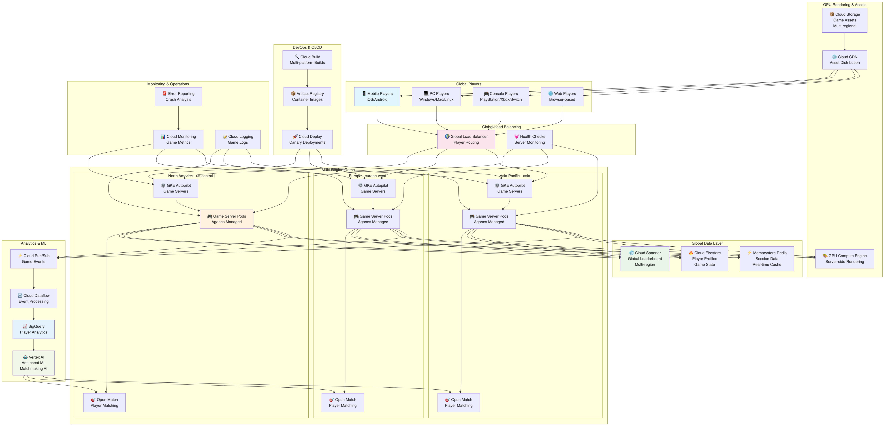
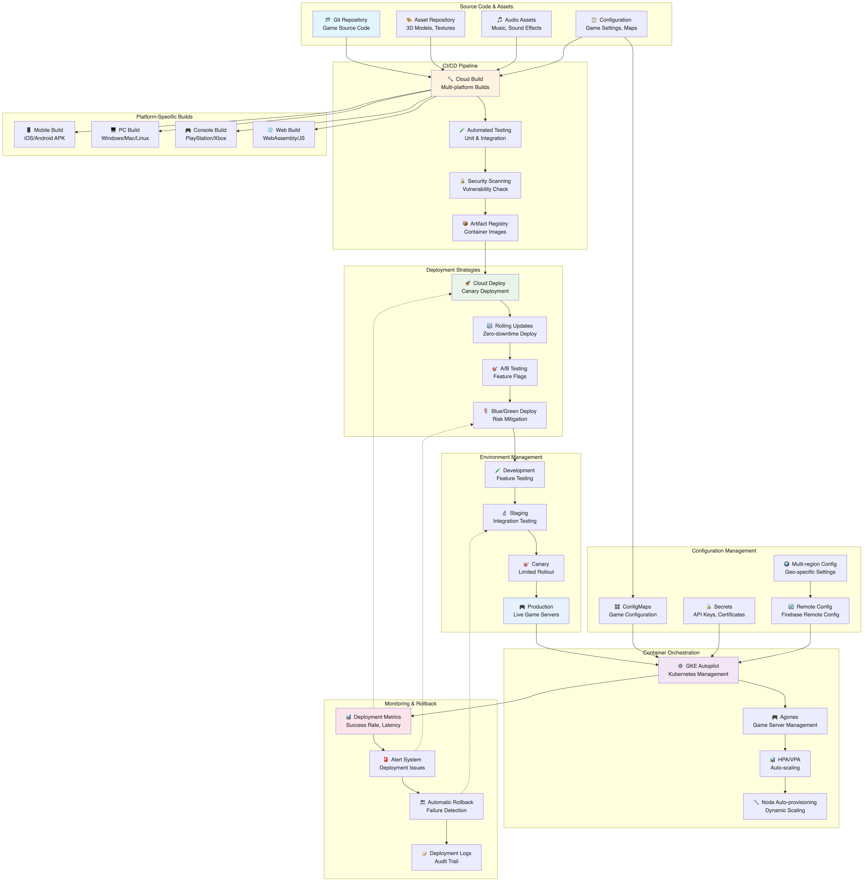

# Mountkirk Games アーキテクチャ推奨案

## 概要

Mountkirk Games の要件に基づいた Google Cloud アーキテクチャ設計案です。低レイテンシゲーミング、グローバルマルチプレーヤー対応、リアルタイムリーダーボード、GPU レンダリング、動的スケーリングを重視した構成を提案します。

## アーキテクチャ概要

### 全体構成

- **グローバル マルチリージョン構成**: 世界規模での低レイテンシゲーミング
- **ゲームアリーナベース アーキテクチャ**: 地域別ゲームサーバー配置
- **クラウドネイティブ設計**: Kubernetes ベースのマイクロサービス
- **リアルタイム データ同期**: グローバルリーダーボード



上図は Mountkirk Games の全体アーキテクチャを示しています。グローバルマルチプレーヤーゲームのための低レイテンシアーキテクチャで、プレーヤーマッチメイキングからゲームセッション、リアルタイムリーダーボードまでを統合したシステムです。

## 推奨 Google Cloud サービス

### 1. ゲームサーバー・コンピューティング

#### Google Kubernetes Engine (GKE)

- **用途**: ゲームサーバーのオーケストレーション
- **構成**:
  - Autopilot モード（管理簡素化）
  - マルチゾーン クラスタ（高可用性）
  - Node Auto Provisioning（動的ノード作成）
  - Spot Instances 活用（コスト最適化）
- **利点**: 自動スケーリング、高可用性、運用効率化

#### Game Servers

- **用途**: 専用ゲームサーバー管理
- **構成**:
  - Open Match 統合（マッチメイキング）
  - Agones（ゲームサーバー管理）
  - グローバルロードバランシング
- **利点**: ゲーム特化最適化、低レイテンシ

#### Compute Engine（GPU付き）

- **用途**: サーバーサイド GPU レンダリング
- **構成**:
  - NVIDIA Tesla/T4 GPU
  - プリエンプティブル インスタンス
  - 自動スケーリング グループ
- **利点**: 高性能レンダリング、コスト効率

### 2. データベース・ストレージ

#### Cloud Spanner

- **用途**: グローバルリーダーボード・ゲーム状態管理
- **構成**:
  - マルチリージョン構成
  - 強整合性保証
  - 水平スケーリング
- **利点**: グローバル分散、低レイテンシ、強整合性

#### Cloud Firestore

- **用途**: プレイヤープロファイル・ゲーム設定
- **構成**:
  - マルチリージョン モード
  - リアルタイムリスナー
  - オフライン同期
- **利点**: NoSQL柔軟性、リアルタイム更新

#### Memorystore for Redis

- **用途**: ゲームセッション・リアルタイムデータ
- **構成**:
  - HA構成（Primary/Replica）
  - クラスタモード
  - VPC内配置
- **利点**: 超低レイテンシ、高性能キャッシュ

#### Cloud Storage

- **用途**: ゲームアセット・ログ保存
- **構成**:
  - Multi-regional（ゲームアセット）
  - Regional（ログファイル）
  - CDN統合
- **利点**: グローバルアクセス、高可用性

### 3. リアルタイム通信・ネットワーキング

#### Cloud Load Balancing

- **用途**: グローバルプレイヤールーティング
- **構成**:
  - Global HTTP(S) Load Balancer
  - Network Load Balancer（UDP対応）
  - 地理的ルーティング
- **利点**: 最適地域ルーティング、低レイテンシ

#### Cloud CDN

- **用途**: ゲームアセット配信
- **構成**:
  - エッジキャッシュ最適化
  - 圧縮・最適化
  - カスタムキャッシュルール
- **利点**: 高速アセットダウンロード、帯域幅削減

#### Firebase Realtime Database

- **用途**: リアルタイムゲームイベント・チャット
- **構成**:
  - WebSocket接続
  - オフライン同期
  - セキュリティルール
- **利点**: リアルタイム双方向通信、自動同期

### 4. データ分析・アナリティクス

#### BigQuery

- **用途**: ゲームアナリティクス・プレイヤー行動分析
- **構成**:
  - ストリーミングインサート
  - パーティション・クラスタリング
  - BigQuery ML 統合
- **利点**: リアルタイム分析、機械学習統合

#### Cloud Dataflow

- **用途**: ゲームログ処理・リアルタイム分析
- **構成**:
  - Apache Beam パイプライン
  - ストリーミング処理
  - 自動スケーリング
- **利点**: リアルタイム処理、高スループット

#### Cloud Pub/Sub

- **用途**: ゲームイベント配信・メッセージング
- **構成**:
  - 順序保証配信
  - Dead Letter Queue
  - グローバル配信
- **利点**: 非同期処理、スケーラビリティ

### 5. 機械学習・AI

#### Vertex AI

- **用途**: プレイヤーマッチメイキング・不正検知
- **構成**:
  - AutoML（行動分析）
  - Custom Models（チート検出）
  - Prediction Endpoints
- **利点**: 高度な分析、自動化

#### Recommendations AI

- **用途**: ゲーム内購入・コンテンツレコメンド
- **構成**:
  - プレイヤー行動学習
  - リアルタイム推薦
  - A/Bテスト統合
- **利点**: 収益最適化、ユーザーエンゲージメント向上

### 6. DevOps・CI/CD

#### Cloud Build

- **用途**: 継続的インテグレーション・ビルド
- **構成**:
  - マルチプラットフォームビルド
  - コンテナイメージ作成
  - セキュリティスキャン
- **利点**: 高速ビルド、自動化

#### Artifact Registry

- **用途**: コンテナ・アーティファクト管理
- **構成**:
  - 脆弱性スキャン
  - バージョン管理
  - アクセス制御
- **利点**: セキュア管理、統合性

#### Cloud Deploy

- **用途**: 継続的デプロイメント
- **構成**:
  - カナリアデプロイ
  - ブルーグリーンデプロイ
  - ロールバック機能
- **利点**: 安全なデプロイ、迅速な修正

### 7. セキュリティ・認証

#### Cloud IAM

- **用途**: リソースアクセス制御
- **構成**:
  - プロジェクト分離
  - 最小権限原則
  - サービスアカウント管理
- **利点**: きめ細かい制御、セキュリティ強化

#### Firebase Authentication

- **用途**: プレイヤー認証・管理
- **構成**:
  - マルチプロバイダー対応
  - 匿名認証
  - カスタムクレーム
- **利点**: 簡単統合、多様な認証方式

#### Cloud Armor

- **用途**: DDoS保護・Webセキュリティ
- **構成**:
  - DDoS軽減
  - WAF機能
  - ジオブロッキング
- **利点**: 攻撃対策、可用性保護

### 8. 監視・運用

#### Cloud Monitoring

- **用途**: ゲームサーバー・インフラ監視
- **構成**:
  - カスタムメトリクス
  - ゲーム特化ダッシュボード
  - SLI/SLO設定
- **利点**: リアルタイム監視、パフォーマンス最適化

#### Cloud Logging

- **用途**: ゲームログ・システムログ集約
- **構成**:
  - 構造化ログ
  - ログベース監視
  - 長期保存
- **利点**: 統合ログ管理、トラブルシューティング

#### Error Reporting

- **用途**: ゲームエラー・クラッシュ監視
- **構成**:
  - 自動エラー検出
  - 重要度分類
  - 通知設定
- **利点**: 迅速な問題発見、品質向上

## 詳細アーキテクチャ設計

### ゲームサーバーアーキテクチャ

#### マルチリージョン配置

```
北米リージョン
├── us-central1 (Primary)
├── us-west1 (Secondary)
└── us-east1 (Backup)

ヨーロッパリージョン
├── europe-west1 (Primary)
├── europe-west2 (Secondary)
└── europe-north1 (Backup)

アジア太平洋リージョン
├── asia-northeast1 (Primary)
├── asia-southeast1 (Secondary)
└── asia-east1 (Backup)
```

#### ゲームアリーナ管理

```
Global Load Balancer
    ↓
Regional Game Clusters
    ↓
Game Server Pods (Agones managed)
    ↓
Player Sessions
```

### データフロー設計

#### リアルタイムリーダーボード

```
Game Events → Pub/Sub → Dataflow → Spanner → Firestore → Client Updates
```


上図は Mountkirk Games のリアルタイムリーダーボードシステムを詳細に示しています。ゲームイベントの収集からグローバルリーダーボードの更新、プレーヤーへのリアルタイム通知まで、一連のデータフローを可視化しています。

#### ゲーム分析パイプライン

```
Game Logs → Cloud Storage → Dataflow → BigQuery → ML Models → Insights
```

#### プレイヤーマッチメイキング

```
Player Request → Open Match → Game Server Assignment → Session Creation
```

### スケーリング戦略

#### 動的スケーリング

- **プレイヤー数ベース**: Horizontal Pod Autoscaler
- **CPU/メモリベース**: Vertical Pod Autoscaler
- **時間ベース**: Scheduled Scaling
- **地域ベース**: Cross-region Load Balancing

#### コスト最適化

- **Spot Instances**: 非クリティカルワークロード
- **Committed Use Discounts**: ベースライン容量
- **Preemptible GPUs**: レンダリングタスク
- **Auto-scaling**: 需要追従

### レイテンシ最適化

#### ネットワーク最適化

- **Premium Tier**: 低レイテンシルーティング
- **Private Google Access**: 内部通信最適化
- **CDN**: 静的コンテンツ高速配信
- **Edge Locations**: 地理的分散

#### データアクセス最適化

- **Redis Cache**: 頻繁アクセスデータ
- **Spanner Regional**: 地域データ配置
- **Connection Pooling**: DB接続効率化
- **Read Replicas**: 読み取り性能向上

## プラットフォーム別対応

### マルチプラットフォーム戦略

#### モバイル（iOS/Android）

- **Firebase SDK**: 統合開発環境
- **Cloud Functions**: サーバーレス処理
- **Firebase Cloud Messaging**: プッシュ通知

#### PC（Windows/Mac/Linux）

- **gRPC**: 高性能通信
- **Protocol Buffers**: 効率的データ交換
- **Native Client Integration**: プラットフォーム固有機能

#### コンソール（PlayStation/Xbox/Nintendo）

- **Custom APIs**: プラットフォーム統合
- **Achievement Systems**: 実績管理
- **Cross-platform Play**: プラットフォーム横断

### GPU レンダリング

#### サーバーサイドレンダリング

- **NVIDIA Tesla T4**: 高性能GPU
- **CUDA/OpenGL**: グラフィックス処理
- **Video Streaming**: リアルタイム配信
- **Dynamic Allocation**: 需要対応

## セキュリティ設計

### プレイヤーデータ保護

- **暗号化**: 保存時・転送時
- **プライバシー**: GDPR/CCPA準拠
- **データ最小化**: 必要最小限収集
- **同意管理**: 透明な許可システム

### チート対策

- **サーバーサイド検証**: 重要処理をサーバーで実行
- **行動分析**: 異常パターン検出
- **機械学習**: チート行動学習
- **リアルタイム監視**: 即座の対処

## 開発・運用プロセス

### CI/CD パイプライン

```
Code Commit → Build → Test → Security Scan → Deploy → Monitor
```



上図は Mountkirk Games の包括的なデプロイメントパイプラインを示しています。ソースコード管理からビルド、テスト、デプロイ、本番環境での運用監視まで、全体的な DevOps ワークフローを可視化しています。

### 環境管理

- **開発環境**: 機能開発・単体テスト
- **ステージング環境**: 統合テスト・負荷テスト
- **本番環境**: ライブサービス
- **災害復旧環境**: バックアップ・切替

### A/Bテスト・実験

- **Firebase Remote Config**: 機能フラグ管理
- **Firebase A/B Testing**: 効果測定
- **カナリアリリース**: 段階的展開
- **フィーチャートグル**: 動的機能制御

## 監視・運用

### ゲーム固有メトリクス

- **同時接続プレイヤー数**: リアルタイム監視
- **マッチメイキング時間**: レイテンシ追跡
- **ゲームセッション時間**: エンゲージメント測定
- **クラッシュ率**: 安定性監視

### SLI/SLO設定

- **可用性**: 99.9%（年間ダウンタイム 8.77時間以内）
- **レスポンス時間**: 95%tile で 100ms以内
- **マッチメイキング**: 平均30秒以内
- **データ同期**: 1秒以内

### アラート・対応

- **自動復旧**: ヘルスチェック・再起動
- **エスカレーション**: 重要度別通知
- **オンコール**: 24/7サポート体制
- **ポストモーテム**: 障害分析・改善

この設計により、Mountkirk Games は低レイテンシで高品質なグローバルマルチプレーヤーゲーム体験を提供しながら、スケーラビリティ、コスト効率、運用効率を実現できます。
