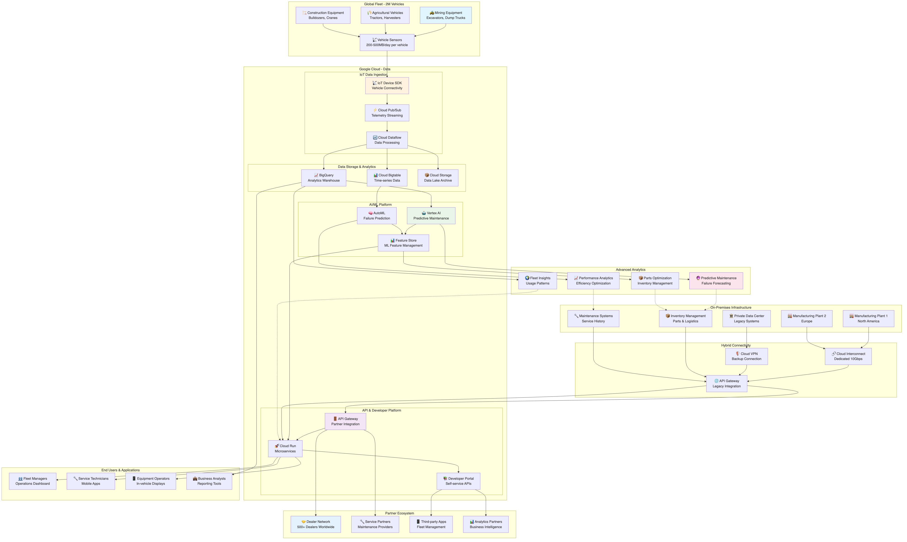
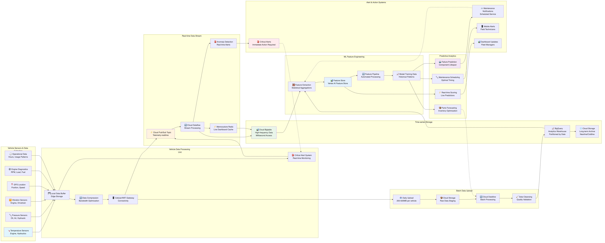
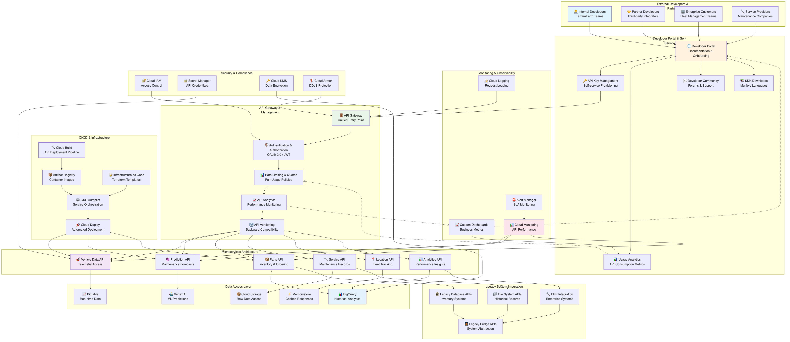

# TerramEarth アーキテクチャ推奨案

## 概要

TerramEarth の要件に基づいた Google Cloud アーキテクチャ設計案です。IoT データ分析、予測保全、ハイブリッドクラウド統合、開発者プラットフォーム、パートナーエコシステムを重視した構成を提案します。

## アーキテクチャ概要

### 全体構成

- **ハイブリッドクラウド アーキテクチャ**: オンプレミスレガシーシステムとの統合
- **IoT データ パイプライン**: 200万台の車両からの大量テレメトリー処理
- **予測保全プラットフォーム**: 機械学習による故障予測・部品最適化
- **開発者エコシステム**: API プラットフォームとセルフサービス環境



上図は TerramEarth の全体アーキテクチャを示しています。200万台の車両からの IoT データ収集から、クラウドでのデータ処理・分析、機械学習による予測保全、パートナーエコシステムへの情報提供まで、エンドツーエンドのビジネスフローを統合したアーキテクチャです。

## 推奨 Google Cloud サービス

### 1. IoT・データ収集・処理

#### Cloud IoT Core（後継：IoT Device SDK + Pub/Sub）

- **用途**: 200万台の車両からのテレメトリー収集
- **構成**:
  - MQTT/HTTP プロトコル対応
  - デバイス認証・管理
  - リアルタイム・バッチデータ処理
- **利点**: 大規模IoT対応、セキュア通信、管理簡素化

#### Cloud Pub/Sub

- **用途**: 車両データのリアルタイム配信・ルーティング
- **構成**:
  - 複数トピック（リアルタイム/バッチ）
  - 順序保証配信
  - Dead Letter Queue
  - グローバル配信
- **利点**: 高スループット、低レイテンシ、信頼性

#### Cloud Dataflow

- **用途**: 大規模データ処理・変換パイプライン
- **構成**:
  - ストリーミング・バッチ処理
  - Apache Beam パイプライン
  - 自動スケーリング
  - データ品質チェック
- **利点**: 統一処理モデル、フォルトトレラント

### 2. データ ウェアハウス・分析

#### BigQuery

- **用途**: 車両テレメトリー分析・データウェアハウス
- **構成**:
  - 時系列データパーティション
  - クラスタリング最適化
  - ストリーミング挿入
  - ML統合（BigQuery ML）
- **利点**: ペタバイト級分析、高速クエリ、ML統合

#### Cloud Bigtable

- **用途**: 高頻度アクセス時系列データ
- **構成**:
  - マルチリージョンレプリケーション
  - HBase API互換
  - 自動シャーディング
- **利点**: 低レイテンシ、線形スケーラビリティ

#### Cloud Storage

- **用途**: データレイク・長期保存
- **構成**:
  - Standard（アクティブデータ）
  - Nearline/Coldline（アーカイブ）
  - Lifecycle管理
  - 地域間レプリケーション
- **利点**: 無制限容量、コスト効率、高可用性

### 3. 機械学習・予測分析

#### Vertex AI

- **用途**: 予測保全・故障予測モデル
- **構成**:
  - AutoML（故障予測）
  - Custom Models（異常検知）
  - Feature Store（特徴量管理）
  - MLOps パイプライン
- **利点**: 統合ML環境、自動化、高精度予測

#### Vertex AI Workbench

- **用途**: データサイエンティスト開発環境
- **構成**:
  - Jupyter Notebook統合
  - GPU/TPUサポート
  - チーム共有環境
- **利点**: 生産性向上、協業促進

#### Cloud AutoML Tables

- **用途**: 構造化データ予測モデル
- **構成**:
  - 部品需要予測
  - メンテナンススケジュール最適化
  - 故障リスク分析
- **利点**: コード不要、高精度、高速開発

### 4. API・開発者プラットフォーム

#### API Gateway

- **用途**: 統一API管理・セキュリティ
- **構成**:
  - レート制限・クォータ管理
  - 認証・認可（OAuth 2.0/JWT）
  - API バージョニング
  - 分析・監視
- **利点**: 統一管理、セキュリティ強化、運用効率

#### Cloud Endpoints

- **用途**: API 監視・分析・ドキュメント
- **構成**:
  - OpenAPI仕様
  - 自動ドキュメント生成
  - パフォーマンス監視
- **利点**: 開発者体験向上、運用可視化

#### Cloud Run

- **用途**: サーバーレス マイクロサービス・API
- **構成**:
  - レガシーシステム抽象化API
  - パートナー統合API
  - データ分析API
  - 自動スケーリング
- **利点**: 運用不要、コスト効率、高可用性

### 5. 開発・CI/CD

#### Cloud Build

- **用途**: 継続的インテグレーション・ビルド
- **構成**:
  - マルチ言語・環境対応
  - コンテナイメージ作成
  - セキュリティスキャン
  - 並列ビルド
- **利点**: 高速ビルド、セキュリティ統合

#### Cloud Deploy

- **用途**: 継続的デプロイメント
- **構成**:
  - 環境別デプロイ戦略
  - カナリア・ブルーグリーン
  - 承認ワークフロー
  - ロールバック機能
- **利点**: 安全なデプロイ、ガバナンス

#### Artifact Registry

- **用途**: コンテナ・アーティファクト管理
- **構成**:
  - 脆弱性スキャン
  - アクセス制御
  - バージョン管理
- **利点**: セキュア管理、統合性

### 6. コンテナ・オーケストレーション

#### Google Kubernetes Engine (GKE)

- **用途**: コンテナワークロード実行・管理
- **構成**:
  - Autopilot モード（管理簡素化）
  - ワークロード Identity
  - Binary Authorization（セキュリティ）
  - マルチクラスタ管理
- **利点**: 運用自動化、セキュリティ強化、スケーラビリティ

#### Cloud Run for Anthos

- **用途**: サーバーレス・ハイブリッド実行
- **構成**:
  - オンプレミス・クラウド統一実行
  - 自動スケーリング
  - イベントドリブン
- **利点**: 統一実行環境、運用簡素化

### 7. セルフサービス・ポータル

#### Cloud Console カスタマイズ

- **用途**: 開発者・パートナー向けセルフサービス
- **構成**:
  - カスタムダッシュボード
  - リソース作成テンプレート
  - 使用量・コスト可視化
- **利点**: ユーザー体験向上、管理効率化

#### Cloud Deployment Manager / Terraform

- **用途**: インフラストラクチャ as Code
- **構成**:
  - 標準化テンプレート
  - 環境別設定
  - ガバナンス・ポリシー
- **利点**: 一貫性、再現性、ガバナンス

#### Cloud Resource Manager

- **用途**: プロジェクト・リソース管理
- **構成**:
  - 組織階層管理
  - プロジェクト自動作成
  - ポリシー継承
- **利点**: 統制とセルフサービスの両立

### 8. ハイブリッド統合・レガシー連携

#### Cloud Interconnect

- **用途**: プライベートデータセンターとの高速接続
- **構成**:
  - Dedicated Interconnect（専用線）
  - Partner Interconnect（パートナー経由）
  - 冗長化構成
- **利点**: 高帯域幅、低レイテンシ、安定接続

#### Cloud VPN

- **用途**: バックアップ接続・リモートアクセス
- **構成**:
  - HA VPN（高可用性）
  - 複数トンネル
  - 動的ルーティング
- **利点**: 冗長性、コスト効率

#### Apigee

- **用途**: レガシーシステム API 管理・変換
- **構成**:
  - プロトコル変換（REST/SOAP）
  - データ形式変換
  - レート制限・セキュリティ
  - 分析・監視
- **利点**: レガシー統合、API変換、段階移行

### 9. セキュリティ・ID管理

#### Cloud IAM

- **用途**: 統合アクセス制御・権限管理
- **構成**:
  - 階層型権限管理
  - カスタムロール
  - 条件付きアクセス
  - サービスアカウント
- **利点**: きめ細かい制御、監査証跡

#### Secret Manager

- **用途**: シークレット・API キー管理
- **構成**:
  - 自動ローテーション
  - バージョン管理
  - アクセス監査
  - アプリケーション統合
- **利点**: セキュア管理、運用効率

#### Cloud KMS

- **用途**: 暗号鍵管理
- **構成**:
  - Customer-managed keys
  - Hardware Security Module
  - 定期ローテーション
- **利点**: データ保護、コンプライアンス

### 10. 監視・運用

#### Cloud Monitoring

- **用途**: 統合監視・メトリクス管理
- **構成**:
  - カスタムメトリクス
  - SLI/SLO管理
  - アラート・通知
  - ダッシュボード
- **利点**: 包括的監視、プロアクティブ対応

#### Cloud Logging

- **用途**: 統合ログ管理・分析
- **構成**:
  - 構造化ログ
  - ログベースメトリクス
  - 長期保存・アーカイブ
  - リアルタイム分析
- **利点**: 中央集約、高速検索、分析

#### Error Reporting

- **用途**: エラー追跡・分析
- **構成**:
  - 自動エラー収集
  - スタックトレース分析
  - 通知・アラート
- **利点**: 迅速な問題発見、品質向上

## 詳細アーキテクチャ設計

### IoT データ パイプライン

#### リアルタイム処理フロー

```
車両センサー → Cloud Pub/Sub → Cloud Dataflow → [異常検知] → アラート配信
                     ↓
               BigQuery/Bigtable → 分析・ダッシュボード
```

#### バッチ処理フロー

```
車両（日次アップロード） → Cloud Storage → Cloud Dataflow → BigQuery → ML トレーニング
```

#### 予測保全パイプライン

```
履歴データ → Feature Engineering → Vertex AI Training → モデル → 予測API → 部品発注システム
```



上図は TerramEarth の IoT データパイプラインを詳細に示しています。車両からのテレメトリーデータ収集から、リアルタイムストリーミング処理、バッチ処理、機械学習による予測モデルの学習と推論、部品需要予測やメンテナンススケジュールの最適化まで、包括的なデータ処理フローを可視化しています。

### ハイブリッド統合設計

#### ネットワーク構成

```
オンプレミス DC
├── レガシーシステム（在庫・ロジ）
├── 製造工場システム
└── Cloud Interconnect → Google Cloud
                           ├── API Gateway
                           ├── 抽象化レイヤ（Cloud Run）
                           └── 新システム
```

#### API 抽象化レイヤ

```
外部システム → API Gateway → 抽象化API → [ルーティング] → レガシー/新システム
```

### 開発者プラットフォーム

#### セルフサービス ポータル

```
開発者ポータル
├── プロジェクト作成
├── API キー管理
├── リソース申請
├── ドキュメント
└── 分析ダッシュボード
```

#### CI/CD パイプライン

```
Git Repository → Cloud Build → [Test/Security Scan] → Cloud Deploy → [Dev/Staging/Prod]
```



上図は TerramEarth の開発者プラットフォームを詳細に示しています。セルフサービスポータル、API 管理、CI/CD パイプライン、パートナーエコシステム、ガバナンスとコンプライアンス管理まで、開発者が効率的に開発・デプロイ・運用できる包括的なプラットフォームを可視化しています。

## 予測保全・分析システム

### 故障予測モデル

#### 使用データ

- **センサーデータ**: 温度、圧力、振動、オイル状態
- **運用データ**: 稼働時間、負荷、作業内容
- **メンテナンス履歴**: 部品交換、修理記録
- **環境データ**: 天候、地形、作業条件

#### 予測アルゴリズム

- **時系列分析**: 異常パターン検出
- **機械学習**: 故障確率算出
- **アンサンブル学習**: 複数モデル統合
- **深層学習**: 複雑パターン認識

#### 活用システム

- **部品需要予測**: 自動発注・在庫最適化
- **メンテナンススケジュール**: 予防保全計画
- **ディーラー通知**: 事前アラート・推奨対応

### 分析プラットフォーム

#### リアルタイム分析

- **ストリーミング処理**: 異常検知・即座アラート
- **ダッシュボード**: 車両状態リアルタイム表示
- **通知システム**: 緊急時自動通知

#### バッチ分析

- **定期レポート**: 週次・月次分析
- **トレンド分析**: 長期パフォーマンス
- **ベンチマーク**: 業界比較・最適化提案

## パートナー エコシステム

### API エコシステム

#### パートナー API

- **データアクセス API**: 車両データ提供
- **予測API**: 故障予測・推奨メンテナンス
- **部品API**: 在庫・価格・発注
- **サービスAPI**: メンテナンス予約・管理

#### 開発者サポート

- **API ドキュメント**: 自動生成・更新
- **SDK提供**: 主要言語対応
- **サンドボックス**: テスト環境提供
- **コミュニティ**: フォーラム・サポート

### マーケットプレイス

#### サードパーティ統合

- **アプリストア**: パートナーアプリ公開
- **データマーケット**: データ販売・購入
- **サービス統合**: 外部サービス連携
- **課金システム**: 使用量ベース課金

## セキュリティ・コンプライアンス

### データ保護

- **暗号化**: 保存時・転送時暗号化
- **アクセス制御**: 役割ベース・属性ベース
- **データ分類**: 機密度別管理
- **監査ログ**: 全アクセス追跡

### プライバシー・コンプライアンス

- **GDPR対応**: データ主体権利・忘れられる権利
- **データ最小化**: 必要最小限収集・保存
- **同意管理**: 明示的同意・目的制限
- **越境データ**: 地域別データ保管

## 運用・監視

### SLI/SLO 設定

#### システム可用性

- **API可用性**: 99.9%
- **データ処理**: 99.95%
- **予測精度**: 90%以上

#### パフォーマンス

- **API レスポンス**: 95%tile 500ms以内
- **データ遅延**: リアルタイム 5秒以内
- **バッチ処理**: 24時間以内完了

### 運用自動化

- **自動復旧**: ヘルスチェック・フェイルオーバー
- **キャパシティ管理**: 需要予測・事前拡張
- **コスト最適化**: 使用量監視・最適化提案

## コスト最適化戦略

### データ管理最適化

- **ストレージ階層**: ホット・ウォーム・コールド
- **データ圧縮**: 効率的格納・転送
- **データライフサイクル**: 自動アーカイブ・削除

### コンピューティング最適化

- **Auto Scaling**: 需要対応・コスト削減
- **Spot/Preemptible**: バッチ処理コスト削減
- **Committed Use**: 長期契約割引

### 監視・アラート

- **コスト監視**: 予算・異常検知
- **使用量分析**: 効率化提案
- **FinOps**: 継続的コスト最適化

この設計により、TerramEarth は IoT データ活用による予測保全、効率的なハイブリッド統合、開発者フレンドリーなプラットフォーム、パートナーエコシステムを実現し、デジタル変革と事業成長を加速できます。
