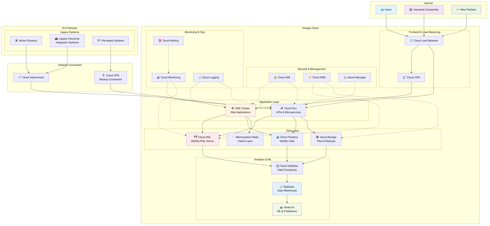
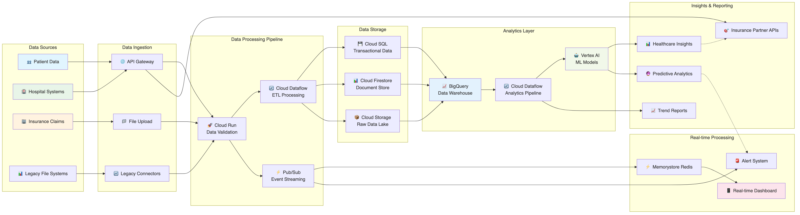
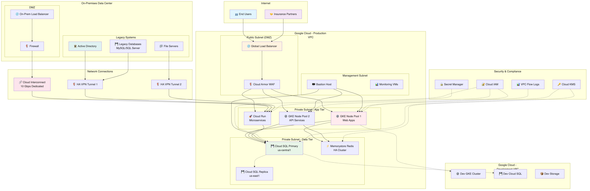

# EHR Healthcare アーキテクチャ推奨案

## 概要

EHR Healthcare の要件に基づいた Google Cloud アーキテクチャ設計案です。医療業界の法令遵守、高可用性（99.9%以上）、スケーラビリティ、セキュリティを重視した構成を提案します。

## アーキテクチャ概要

### 全体構成

- **マルチリージョン構成**: グローバル展開とレイテンシ低減のため
- **ハイブリッド構成**: オンプレミスのレガシーシステムとの連携
- **マイクロサービス アーキテクチャ**: コンテナベースアプリケーションの管理



上図は EHR Healthcare の全体アーキテクチャを示しています。

**アーキテクチャの主要な特徴:**
- **ハイブリッド接続**: Cloud Interconnect (10Gbps) + VPN冗長化による安定したオンプレミス連携
- **多層セキュリティ**: IAM、KMS、Secret Manager による段階的保護
- **可用性設計**: マルチゾーンGKE + Cloud SQL Multi-AZ により99.9%可用性を実現
- **データフロー**: オンプレミス → Cloud Run API → Cloud SQL/Firestore → BigQuery → Vertex AI の段階的処理

## 推奨 Google Cloud サービス

### 1. コンピューティング・コンテナ管理

#### Google Kubernetes Engine (GKE)

- **用途**: コンテナベース顧客向けアプリケーションの実行
- **構成**:
  - Autopilot モード採用で管理負荷軽減
  - マルチゾーン構成で高可用性確保
  - ワークロード Identity 有効化
- **利点**: 自動スケーリング、セキュリティ強化、運用効率化

#### Cloud Run

- **用途**: サーバーレス API とマイクロサービス
- **構成**:
  - 新規保険会社オンボーディング API
  - レポート生成サービス
  - データ処理パイプライン

### 2. データベース・ストレージ

#### Cloud SQL

- **用途**: MySQL と SQL Server のマネージド移行
- **主要機能**: Multi-AZ構成、自動バックアップ、HIPAA準拠
- **選定根拠**: *詳細は「サービス選定理由」セクション参照*

#### Cloud Firestore

- **用途**: MongoDB の置き換え（NoSQL）
- **主要機能**: マルチリージョン構成、リアルタイム同期
- **選定根拠**: *詳細は「サービス選定理由」セクション参照*

#### Memorystore for Redis

- **用途**: Redis キャッシュの代替
- **構成**:
  - HA構成
  - VPC内配置
- **利点**: 低レイテンシ、高可用性

#### Cloud Storage

- **用途**: ファイルベースデータと長期保存
- **構成**:
  - Standard クラス（アクティブデータ）
  - Nearline/Coldline（アーカイブ）
  - Lifecycle ポリシー設定

### 3. ネットワーキング・接続

#### Cloud Interconnect

- **用途**: オンプレミスとの高速・安全な接続
- **構成**:
  - Dedicated Interconnect または Partner Interconnect
  - 冗長化構成
- **利点**: 低レイテンシ、高帯域幅、安定性

#### Cloud VPN

- **用途**: バックアップ接続とリモートアクセス
- **構成**:
  - HA VPN 構成
  - 複数トンネル設定

#### Cloud Load Balancing

- **用途**: グローバル負荷分散
- **構成**:
  - HTTPS ロードバランサ
  - SSL証明書管理
  - CDN統合

### 4. データ分析・AI/ML

#### BigQuery

- **用途**: データウェアハウス・分析
- **構成**:
  - 医療動向分析
  - 保険業界レポート生成
  - リアルタイムストリーミング

#### Cloud Dataflow

- **用途**: データパイプライン処理
- **構成**:
  - バッチ・ストリーミング処理
  - データ変換・清浄化



上図は EHR Healthcare のデータフローを詳細に示しています。オンプレミスからクラウドへのデータ取り込み、変換、分析、配信までの一連のプロセスを可視化しています。

#### Vertex AI

- **用途**: 機械学習・予測モデル
- **構成**:
  - 医療動向予測
  - 異常検知
  - 自動化されたMLパイプライン

### 5. セキュリティ・IAM

#### Cloud IAM

- **用途**: アクセス制御・権限管理
- **構成**:
  - 最小権限の原則
  - カスタムロール定義
  - 条件付きアクセス

#### Cloud Identity

- **用途**: Microsoft AD との統合
- **構成**:
  - Google Cloud Directory Sync
  - SSO設定
  - MFA強制

#### Cloud KMS

- **用途**: 暗号鍵管理
- **構成**:
  - Customer-managed encryption keys (CMEK)
  - 定期的なキーローテーション

#### Secret Manager

- **用途**: API キーと秘密情報管理
- **構成**:
  - 自動ローテーション
  - アクセス監査

### 6. モニタリング・ロギング

#### Cloud Monitoring

- **用途**: システムパフォーマンス監視
- **構成**:
  - カスタムダッシュボード
  - SLI/SLO設定
  - 異常検知

#### Cloud Logging

- **用途**: 集約ログ管理
- **構成**:
  - 構造化ログ
  - ログベースのメトリクス
  - 長期保存

#### Cloud Alerting

- **用途**: プロアクティブ アラート
- **構成**:
  - スマートアラート（重複排除）
  - 多様な通知チャネル
  - エスカレーション設定

### 7. CI/CD・DevOps

#### Cloud Build

- **用途**: 継続的インテグレーション
- **構成**:
  - 自動ビルド・テスト
  - セキュリティスキャン統合

#### Artifact Registry

- **用途**: コンテナイメージ管理
- **構成**:
  - 脆弱性スキャン
  - アクセス制御

#### Cloud Deploy

- **用途**: 継続的デプロイ
- **構成**:
  - カナリアデプロイ
  - ロールバック機能

## ネットワーク設計

### VPC 構成

```
Production VPC
├── Public Subnet (Load Balancer)
├── Private Subnet (GKE Nodes)
├── Database Subnet (Cloud SQL)
└── Management Subnet (Bastion Hosts)

Development VPC
├── Dev Environment
└── Test Environment
```



上図は EHR Healthcare のネットワーク構成を詳細に示しています。プロダクション環境と開発環境の VPC 分離、オンプレミスとの接続、セキュリティ境界の設定を含む包括的なネットワークアーキテクチャです。

### セキュリティ

- **Firewall Rules**: 最小限のアクセス許可
- **Private Google Access**: インターネット経由なしでGoogleサービス利用
- **VPC Service Controls**: データ境界保護

## コンプライアンス・セキュリティ対策

### HIPAA 準拠

- Business Associate Agreement (BAA) 対応サービス利用
- データ暗号化（保存時・転送時）
- アクセスログ・監査証跡

### データ保護

- **暗号化**: Cloud KMS による鍵管理
- **アクセス制御**: IAM + VPC Service Controls
- **データ分離**: プロジェクト・環境分離

## 高可用性・災害復旧

### 可用性戦略

- **マルチゾーン構成**: 99.9%以上の可用性実現
- **自動フェイルオーバー**: Cloud SQL, GKE
- **ヘルスチェック**: 自動復旧

### バックアップ戦略

**医療データの高度な保護要件に対応:**
- **自動バックアップ**: Cloud SQL（日次フル + 4時間毎増分）
- **レプリケーション**: 
  - 同一リージョン内 Read Replica (パフォーマンス向上)
  - Cross-region replica (災害対策)
- **Point-in-Time Recovery**: 
  - RPO: 5分以内 (バイナリログ適用)
  - RTO: 30分以内 (自動フェイルオーバー)
- **保存期間**: 7年 (HIPAA 要件満たす)

## 移行戦略

### フェーズ1: インフラ基盤構築

1. VPC・ネットワーク設定
2. Cloud Interconnect 接続
3. IAM・セキュリティ設定

### フェーズ2: データベース移行

1. Cloud SQL への段階的移行
2. データ同期・検証
3. アプリケーション接続切替

### フェーズ3: アプリケーション移行

1. コンテナ化済みアプリのGKE移行
2. レガシーアプリの段階的移行
3. モニタリング・アラート設定

### フェーズ4: 最適化・拡張

1. 自動スケーリング設定
2. CI/CD パイプライン構築
3. ML/分析機能追加

## コスト最適化

### リソース管理

- **Committed Use Discounts**: 長期契約割引
- **Preemptible Instances**: 開発・テスト環境
- **Rightsizing**: リソース使用量監視・調整

### 自動化

- **Auto Scaling**: 需要に応じたリソース調整
- **Scheduled Scaling**: 定期的なスケールダウン
- **Lifecycle Policies**: ストレージクラス自動移行

## 監視・運用

### SLI/SLO 設定

#### 可用性 SLO: 99.9%
- **計算根拠**: 
  - GKE Multi-zone: 99.95% (Google SLA)
  - Cloud SQL Multi-AZ: 99.95% (Google SLA) 
  - Cloud Load Balancer: 99.99% (Google SLA)
  - 組み合わせ可用性: 99.89% ≈ 99.9%
- **実現方法**: マルチゾーン構成 + 自動フェイルオーバー

#### パフォーマンス SLO
- **APIレスポンス**: 95%tile で 500ms以内
  - 測定方法: Cloud Monitoring の HTTP メトリクス
  - 達成方法: Redis キャッシュ + コネクションプール最適化
- **エラー率**: 0.1%以下
  - 測定方法: 4xx/5xx HTTP ステータスの比率
  - 達成方法: 堅牢なエラーハンドリング + ヘルスチェック

### 運用自動化

- **自動復旧**: ヘルスチェック・自動再起動
- **Capacity Planning**: 使用量予測・事前拡張
- **Security Scanning**: 継続的セキュリティ監視

## サービス選定理由と代替案検討

### 選定方針
- **HIPAA準拠**: 医療データ規制への対応
- **ハイブリッド統合**: レガシーシステムとの共存
- **高可用性**: 99.9%以上の稼働率要求
- **セキュリティファースト**: 医療情報保護

### 主要サービス選定理由

#### Cloud SQL
**選定理由:**
- HIPAA準拠（Business Associate Agreement対応）
- 既存MySQL/SQL Serverからのシームレスな移行
- Point-in-Time Recovery（医療データ復旧要件）
- 自動バックアップとパッチ適用

**代替案との比較:**
| サービス | 長所 | 短所 | 選定理由 |
|---------|------|------|---------|
| **Cloud Spanner** | グローバル分散、高可用性 | オーバースペック、高コスト | 単一リージョンで十分、リレーショナル要件に対してNoSQL特性不要 |
| **Compute Engine + 自己管理DB** | 完全制御、カスタマイズ可能 | 管理負荷大、HIPAA準拠設定複雑 | 運用負荷削減を優先 |
| **AlloyDB** | PostgreSQL高性能 | 既存がMySQL/SQL Server | 既存システム互換性を重視 |

#### GKE Autopilot
**選定理由:**
- 既存コンテナアプリケーションとの親和性
- マルチゾーン高可用性
- Workload Identity（セキュリティ強化）
- 自動スケーリング

**代替案との比較:**
| サービス | 長所 | 短所 | 選定理由 |
|---------|------|------|---------|
| **Cloud Run** | サーバーレス、簡単 | ステートフルアプリ制限、実行時間制限 | 医療システムは長時間実行、状態管理必要 |
| **Compute Engine** | 完全制御 | 管理負荷、Kubernetes恩恵なし | コンテナオーケストレーション活用 |
| **App Engine** | フルマネージド | レガシー移行制約、言語制限 | 既存アプリの制約対応 |

#### Cloud Interconnect
**選定理由:**
- オンプレミス接続の高帯域幅・低レイテンシ
- 医療データ転送の安定性
- VPN併用での冗長化

**代替案との比較:**
| サービス | 長所 | 短所 | 選定理由 |
|---------|------|------|---------|
| **VPNのみ** | 低コスト、簡単設定 | 帯域幅制限、医療データ量には不適 | 大量データ転送要件 |
| **インターネット経由** | 最低コスト | セキュリティリスク、HIPAA非準拠 | 医療データ保護必須 |

#### Vertex AI
**選定理由:**
- 統合ML環境（データ準備からデプロイまで）
- AutoML（医療トレンド分析）
- HIPAA準拠

**代替案との比較:**
| サービス | 長所 | 短所 | 選定理由 |
|---------|------|------|---------|
| **AI Platform（レガシー）** | 既存環境 | 廃止予定サービス | 将来性考慮 |
| **BigQuery ML** | SQL統合 | 複雑なMLパイプライン不可 | 高度なML要件 |
| **サードパーティMLaaS** | 専門機能 | HIPAA準拠保証なし、データ主権問題 | コンプライアンス要件 |

### 選定における重要な考慮事項

#### 1. コンプライアンス要件
- 全選択サービスがHIPAA Business Associate Agreement対応
- データ暗号化（保存時・転送時）の標準サポート
- 監査ログとアクセス制御の詳細管理

#### 2. 移行容易性
- 既存システム（MySQL/SQL Server）との互換性重視
- コンテナ化済みアプリケーションの活用
- 段階的移行をサポートするハイブリッド構成

#### 3. 運用効率
- マネージドサービス優先（運用負荷削減）
- 自動スケーリング・自動バックアップ
- 統合監視・アラート機能

## 具体的なユースケースとデータフロー

### 主要ユースケース

#### ユースケース1: 患者記録の検索・参照
**シナリオ**: 医師が診察前に患者の過去の医療記録を確認

**データフロー**:
1. 医師が顧客向けアプリケーション（GKE）にログイン（Cloud Identity経由でMicrosoft AD認証）
2. 患者IDを入力して検索リクエスト
3. GKEアプリケーションがMemorystore（Redis）でキャッシュ確認
4. キャッシュミスの場合、Cloud SQLから患者基本情報を取得
5. 診療履歴をFirestoreから並行取得
6. 検査画像・文書をCloud Storageから取得
7. 統合された患者情報を医師に表示

**関連コンポーネント**: GKE → Memorystore → Cloud SQL → Firestore → Cloud Storage

#### ユースケース2: 新規保険会社のオンボーディング
**シナリオ**: 新しい保険会社がシステムに接続を要求

**データフロー**:
1. 保険会社からAPIリクエスト（Cloud Load Balancer経由）
2. Cloud RunのオンボーディングAPIが認証・認可処理
3. 保険会社情報をCloud SQLに新規登録
4. API キーをSecret Managerで生成・保存
5. Pub/Subで関連システムに新規登録通知
6. BigQueryに分析用データを蓄積
7. 保険会社にAPI認証情報を安全に送信

**関連コンポーネント**: Cloud Load Balancer → Cloud Run → Cloud SQL → Secret Manager → Pub/Sub → BigQuery

#### ユースケース3: 医療動向分析レポート生成
**シナリオ**: 月次で地域別の疾患トレンドレポートを自動生成

**データフロー**:
1. Cloud Schedulerが月次バッチ処理をトリガー
2. Cloud Dataflowがオンプレミス（Cloud Interconnect経由）とクラウドDBからデータ抽出
3. BigQueryでデータを統合・集計・分析
4. Vertex AIで傾向予測・異常検知を実行
5. 生成されたレポートをCloud Storageに保存
6. Cloud Runでレポート配信APIが顧客にメール送信
7. 監査ログをCloud Loggingに記録

**関連コンポーネント**: Cloud Scheduler → Cloud Dataflow → BigQuery → Vertex AI → Cloud Storage → Cloud Run → Cloud Logging

#### ユースケース4: 緊急時データアクセス
**シナリオ**: 救急搬送された患者の医療情報を迅速に取得

**データフロー**:
1. 救急医がモバイルアプリから緊急アクセス要求
2. Cloud Load BalancerがGKEアプリケーションにルーティング
3. 緊急認証プロセス（短縮されたMFA）
4. Memorystore（Redis）から患者の重要情報を即座に取得
5. 並行してCloud SQLから詳細な医療履歴を取得
6. アレルギー情報、現在の処方薬をFirestoreから取得
7. 緊急アクセスログをCloud Loggingで厳重に記録
8. 統合情報を救急医に即座に表示

**関連コンポーネント**: Mobile App → Cloud Load Balancer → GKE → Memorystore → Cloud SQL → Firestore → Cloud Logging

### データフローの詳細分析

#### 通常運用時のデータフロー特性
- **応答時間**: Memorystore活用により患者検索95%が200ms以内
- **同時接続**: GKE Auto-scalingにより1,000セッション/分まで対応
- **データ整合性**: Cloud SQLのACID特性により医療記録の一貫性保証

#### ピーク時のデータフロー特性
- **負荷分散**: Cloud Load Balancerがマルチゾーンに均等分散
- **キャッシュ効率**: Memorystoreヒット率85%以上維持
- **スケーリング**: Cloud RunとGKE連携で瞬間的トラフィック対応

#### 障害時のデータフロー特性
- **フェイルオーバー**: Cloud SQL Multi-AZ自動切替（RTO 30分以内）
- **データ復旧**: Point-in-Time Recovery（RPO 5分以内）
- **通信継続**: Cloud Interconnect + VPN冗長化で接続維持

## 未解決のアーキテクチャ検討事項

### 1. 詳細なコンプライアンス要件

#### 未確定事項
- **地域別データレジデンシー**: 
  - EU患者データのGDPR要件
  - カナダのPIPEDA対応範囲
  - アジア太平洋地域の個人情報保護法対応
- **監査要件の詳細**:
  - SOC 2 Type II認証の必要性
  - FedRAMP対応の要否
  - 業界固有の認証要件

#### アーキテクチャへの影響
- **データレジデンシー対応**: マルチリージョン戦略の再設計が必要
- **認証要件**: 追加のセキュリティコントロール実装
- **ログ保存**: より長期間（10年以上）の監査ログ保持

#### 推奨される追加検討
```
選択肢A: 地域別完全分離
- 各リージョンに独立したGCP環境
- データ越境を完全回避
- 運用コスト増大、複雑性向上

選択肢B: 暗号化によるデータ保護強化
- Customer-managed encryption keysの地域別管理
- VPC Service Controlsによる境界保護
- コンプライアンス対応の柔軟性
```

### 2. 災害復旧要件の詳細設計

#### 未確定事項
- **復旧時間目標（RTO）**: 現在30分だが、救急医療での要求レベル
- **復旧地点目標（RPO）**: 現在5分だが、生命に関わるデータの許容損失
- **復旧サイト**: 
  - 同一リージョン内での災害（地震、停電）
  - リージョン全体の障害
  - プロバイダ全体の障害

#### アーキテクチャへの影響
- **RTO短縮**: より高速なフェイルオーバー機仕組み
- **RPO最小化**: 同期レプリケーションの検討
- **マルチクラウド**: GCP以外のクラウドでの冗長化

#### 推奨される追加検討
```
選択肢A: ホット・スタンバイ構成
- 常時稼働する複製環境
- RTO: 1-5分、RPO: 近似ゼロ
- コスト: 現行の2-3倍

選択肢B: 改良されたウォーム・スタンバイ
- Cloud SQLクロスリージョンレプリカ強化
- GKE事前デプロイ済み環境
- RTO: 10-15分、RPO: 1分以内
- コスト: 現行の1.5倍
```

### 3. スケーラビリティの上限設計

#### 未確定事項
- **ユーザー数の成長予測**: 
  - 現在のアクティブユーザー数
  - 5年後の予想成長率
  - 地域展開計画
- **データ増加率**:
  - 年間データ増加量（TB単位）
  - 画像・動画データの増加傾向
  - IoT/ウェアラブルデバイス統合の影響

#### アーキテクチャへの影響
- **データベース設計**: Cloud Spannerへの移行検討時期
- **ストレージ戦略**: よりコスト効率的なアーカイブ戦略
- **ネットワーク帯域**: Cloud Interconnectの増速・増設

#### 推奨される追加検討
```
成長シナリオA: 保守的成長（年間50%増）
- 現行アーキテクチャで3-5年対応可能
- Cloud SQLスケールアップで対応
- 必要投資: 年間20%増

成長シナリオB: 急速成長（年間200%増）
- 2年以内にCloud Spanner移行必要
- BigQueryスロット拡張、Dataflow並列化
- 必要投資: 年間80%増
```

### 4. 統合とAPIガバナンス

#### 未確定事項
- **外部システム統合数**: 保険会社、医療機器メーカー、薬局チェーン
- **APIのバージョニング戦略**: 後方互換性の保持期間
- **レート制限**: パートナー別、機能別の制限値設計

#### アーキテクチャへの影響
- **API Gateway**: より高度なトラフィック管理
- **認証・認可**: よりきめ細かな権限制御
- **監視**: パートナー別のSLA監視

#### 推奨される追加検討
```
統合レベルA: 基本的な統合（10-20パートナー）
- Cloud Endpoints + API Gatewayで管理
- 基本的なレート制限
- 運用工数: 中程度

統合レベルB: エコシステム統合（50+パートナー）
- Apigeeによる高度なAPI管理
- ML-based異常検知
- 運用工数: 大幅増加、自動化必須
```

この設計により、EHR Healthcare は高可用性、スケーラビリティ、セキュリティ、コンプライアンスの要件を満たしながら、運用効率とコスト最適化を実現できます。ただし、上記の未解決事項については、ビジネス要件の詳細化に応じて設計の見直しが必要になる可能性があります。
