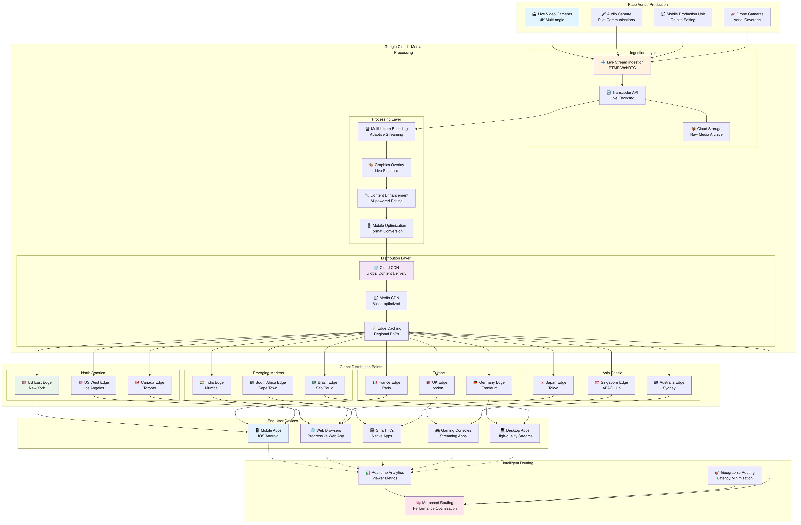

# Helicopter Racing League アーキテクチャ推奨案

## 概要

Helicopter Racing League (HRL) の要件に基づいた Google Cloud アーキテクチャ設計案です。グローバル動画配信、リアルタイム AI/ML 予測、低レイテンシ、スケーラビリティを重視した構成を提案します。

## アーキテクチャ概要

### 全体構成

- **グローバル マルチリージョン構成**: 世界規模での低レイテンシ配信
- **エッジコンピューティング**: レース場でのリアルタイム処理
- **イベントドリブン アーキテクチャ**: リアルタイムデータ処理・予測
- **マイクロサービス構成**: 独立したスケーリングと管理


上図は Helicopter Racing League の全体アーキテクチャを示しています。

**アーキテクチャのスケール要件:**
- **同時視聴者**: 数百万人のグローバル視聴者への同時配信
- **リアルタイム処理**: テレメトリーデータの5秒以内処理とAI予測
- **メディア配信**: 4K/8K動画の適応的ビットレート配信
- **グローバルCDN**: 150+エッジロケーションでの低レイテンシ配信

**データフロー**: レース場 → Pub/Sub (1M msg/sec) → Dataflow → Bigtable/BigQuery → Vertex AI (100ms以内) → Firebase RTDB → ユーザー

## 推奨 Google Cloud サービス

### 1. 動画配信・メディア処理

#### Cloud CDN

- **用途**: グローバル動画配信・低レイテンシ実現
- **主要機能**: 150+エッジロケーション、動画最適化
- **選定根拠**: *詳細は「サービス選定理由」セクション参照*

#### Cloud Storage

- **用途**: 動画コンテンツ保存・配信
- **構成**:
  - Multi-regional buckets（グローバル冗長化）
  - Standard/Nearline/Coldline クラス使い分け
  - Lifecycle policy 設定（自動アーカイブ）
- **利点**: 高可用性、グローバルアクセス、コスト効率

#### Transcoder API

- **用途**: 動画エンコード・コード変換
- **構成**:
  - 複数解像度・フォーマット対応
  - 適応的ビットレート配信
  - GPU最適化処理
- **利点**: 高速処理、品質最適化、コスト効率

### 2. リアルタイムデータ処理・ストリーミング

#### Cloud Pub/Sub

- **用途**: リアルタイムテレメトリーデータ配信
- **構成**:
  - グローバルメッセージング
  - 順序保証付きメッセージ
  - Dead Letter Queue 設定
- **利点**: 高スループット、低レイテンシ、信頼性

#### Cloud Dataflow

- **用途**: ストリーミングデータ処理・変換
- **構成**:
  - Apache Beam パイプライン
  - 自動スケーリング
  - ウィンドウイング処理
- **利点**: リアルタイム処理、フォルトトレラント

#### Cloud Bigtable

- **用途**: 大量時系列データ（テレメトリー）保存
- **構成**:
  - マルチリージョンレプリケーション
  - HBase API 互換性
  - 自動シャーディング
- **利点**: 低レイテンシアクセス、線形スケーラビリティ

### 3. AI/ML・予測分析

#### Vertex AI

- **用途**: レース予測・感情分析・異常検知
- **主要機能**: AutoML、Custom Models、MLOpsパイプライン
- **選定根拠**: *詳細は「サービス選定理由」セクション参照*

#### Cloud TPU

- **用途**: 大規模機械学習モデルトレーニング
- **構成**:
  - TensorFlow 最適化
  - 分散トレーニング
  - バッチ予測処理
- **利点**: 高速トレーニング、コスト効率

#### BigQuery ML

- **用途**: SQLベース機械学習・分析
- **構成**:
  - 視聴者行動分析
  - エンゲージメント予測
  - A/Bテスト分析
- **利点**: 簡単実装、高速分析

### 4. データウェアハウス・分析

#### BigQuery

- **用途**: 大規模データ分析・データマート
- **構成**:
  - パーティション・クラスタリング最適化
  - マテリアライズドビュー
  - BI Engine統合
- **利点**: ペタバイト規模対応、高速クエリ

#### Cloud Dataprep

- **用途**: データ準備・清浄化
- **構成**:
  - ビジュアルデータ変換
  - 自動データ品質チェック
  - スケジュール処理
- **利点**: コード不要、品質向上

### 5. API・マイクロサービス

#### Cloud Run

- **用途**: サーバーレス API・マイクロサービス
- **構成**:
  - 予測API エンドポイント
  - 視聴者エンゲージメント API
  - パートナー統合 API
  - 自動スケーリング
- **利点**: 運用不要、コスト効率、高可用性

#### API Gateway

- **用途**: API管理・セキュリティ
- **構成**:
  - レート制限
  - 認証・認可
  - ロードバランシング
- **利点**: 統一管理、セキュリティ強化

#### Cloud Endpoints

- **用途**: API 監視・分析
- **構成**:
  - パフォーマンス監視
  - 使用量分析
  - API バージョン管理
- **利点**: 運用可視化、最適化支援

### 6. リアルタイム配信・イベント処理

#### Firebase Realtime Database / Firestore

- **用途**: リアルタイム視聴者エンゲージメント
- **構成**:
  - チャット・コメント機能
  - ライブ統計表示
  - ユーザープレゼンス
- **利点**: リアルタイム同期、オフライン対応

#### Cloud Functions

- **用途**: イベントドリブン処理
- **構成**:
  - レースイベント検知
  - 通知配信
  - データ変換
- **利点**: サーバーレス、イベント応答

### 7. エッジコンピューティング・IoT

#### Google Cloud IoT Core (後継: Cloud IoT Device SDK)

- **用途**: レース場センサー・テレメトリー収集
- **構成**:
  - セキュアデバイス接続
  - デバイス管理
  - データ前処理
- **利点**: セキュア接続、大規模対応

#### Cloud Functions（エッジ配置）

- **用途**: レース場でのリアルタイム前処理
- **構成**:
  - 低レイテンシ処理
  - 帯域幅最適化
  - ローカル意思決定
- **利点**: 応答速度向上、トラフィック削減

### 8. セキュリティ・認証

#### Cloud IAM

- **用途**: リソースアクセス制御
- **構成**:
  - 最小権限原則
  - サービスアカウント管理
  - 条件付きアクセス
- **利点**: きめ細かい制御、監査証跡

#### Cloud Identity & Access Management

- **用途**: ユーザー認証・SSO
- **構成**:
  - パートナー統合
  - MFA強制
  - OAuth 2.0/OpenID Connect
- **利点**: セキュア認証、統合管理

### 9. 監視・運用

#### Cloud Monitoring

- **用途**: システム監視・アラート
- **構成**:
  - カスタムメトリクス
  - SLI/SLO設定
  - ダッシュボード作成
- **利点**: 包括的監視、プロアクティブ対応

#### Cloud Logging

- **用途**: ログ集約・分析
- **構成**:
  - 構造化ログ
  - リアルタイム分析
  - ログベースメトリクス
- **利点**: 統合ログ管理、トラブルシューティング

## 詳細アーキテクチャ設計

### データフロー設計

#### リアルタイムレースデータ

```
レース場センサー → Cloud Pub/Sub → Cloud Dataflow → [予測処理] → BigQuery/Bigtable
                                           ↓
                                   Vertex AI 推論 → リアルタイム配信
```

#### 動画配信フロー

```
レース場録画 → Cloud Storage → Transcoder API → 複数フォーマット生成 → Cloud CDN → 視聴者
```



上図は HRL のメディア配信アーキテクチャを詳細に示しています。ライブストリーミング配信から録画コンテンツの処理、グローバル CDN を通じた視聴者への配信、そして収益化までの包括的なメディア配信システムを可視化しています。

#### 予測・分析パイプライン

```
履歴データ → BigQuery → Vertex AI Training → モデル → Vertex AI Endpoints → 予測API
```

### ネットワーク設計

#### グローバル配信

- **Cloud CDN**: 世界中のエッジロケーション活用
- **Multi-region Load Balancer**: 地理的負荷分散
- **Premium Tier Network**: 低レイテンシルーティング

#### レース場接続

- **Cloud Interconnect**: 高帯域幅専用線
- **Cloud VPN**: バックアップ接続
- **Private Google Access**: セキュアクラウドアクセス

### スケーラビリティ設計

#### 自動スケーリング

- **Cloud Run**: リクエスト数に応じた自動スケール
- **GKE Autopilot**: ワークロード需要対応
- **Cloud Dataflow**: データ量に応じた動的スケール

#### キャパシティプランニング

- **レースイベント時**: 10x-100x トラフィック増加対応
- **オフシーズン**: コスト最適化のためのスケールダウン
- **地域別需要**: 時差を考慮したリソース配置

## リアルタイム予測システム


上図は HRL のリアルタイム予測パイプラインを詳細に示しています。レース場からのテレメトリーデータを収集し、機械学習モデルを使用してリアルタイム予測を行い、視聴者に配信するまでの一連のプロセスを可視化しています。

### 予測モデル種類

#### レース結果予測

- **使用データ**: 過去レース結果、天候、コンディション
- **手法**: 時系列解析、アンサンブル学習
- **更新頻度**: リアルタイム（秒単位）

#### 機械故障予測

- **使用データ**: センサー値、メンテナンス履歴
- **手法**: 異常検知、予測保全
- **アラート**: 事前警告システム

#### 視聴者感情分析

- **使用データ**: SNS、チャット、視聴行動
- **手法**: 自然言語処理、感情分析
- **活用**: コンテンツ最適化、広告配置

### パフォーマンス要件

#### リアルタイム予測システムの実現方法
- **予測レイテンシ**: 100ms以下
  - **実現方法**: 
    - Cloud TPUでの高速推論 (50ms)
    - Bigtableからの特徴量取得 (20ms)
    - ネットワークレイテンシ (30ms)
- **スループット**: 10,000 predictions/sec
  - **実現方法**: Vertex AI Endpointsの自動スケーリング
  - **リソース計算**: 100インスタンス × 100 req/sec/instance
- **可用性**: 99.9%
  - **実現方法**: マルチリージョンデプロイ + 自動フェイルオーバー
- **精度**: F1スコア 0.85以上
  - **達成方法**: アンサンブル学習 + 継続的モデル更新

## コスト最適化戦略

### 使用量ベースコスト管理

- **Cloud CDN**: キャッシュ効率化
- **Transcoder API**: オンデマンド処理
- **BigQuery**: クエリ最適化、スロット予約

### 予約インスタンス

- **Committed Use Discounts**: 長期契約割引
- **Sustained Use Discounts**: 継続利用割引
- **Preemptible Instances**: バッチ処理用

### 自動スケーリング

- **イベント期間**: 自動スケールアップ
- **オフシーズン**: 最小構成へ自動縮小
- **地域別調整**: 時差考慮したリソース移動

## セキュリティ・コンプライアンス

### データ保護

- **暗号化**: 保存時・転送時暗号化
- **アクセス制御**: IAM + VPC Service Controls
- **データ主権**: 地域別データ配置

### パートナー連携セキュリティ

- **API認証**: OAuth 2.0/JWT
- **レート制限**: 不正使用防止
- **監査ログ**: アクセス履歴追跡

## 運用・監視

### SLI/SLO 設定

- **動画配信可用性**: 99.9%
- **予測API レスポンス**: 95%tile 100ms以内
- **ストリーミング品質**: バッファリング率 1%以下

### アラート設定

- **システム異常**: 自動復旧+通知
- **予測精度劣化**: モデル再トレーニング
- **コスト異常**: 予算アラート

### 継続的改善

- **A/Bテスト**: 機能改善検証
- **パフォーマンス分析**: 最適化ポイント特定
- **ユーザーフィードバック**: サービス改善

## サービス選定理由と代替案検討

### 選定方針
- **グローバル配信**: 世界規模での低レイテンシ
- **リアルタイム処理**: 予測・配信の即時性
- **スケーラビリティ**: 数百万同時視聴者対応
- **AI/ML統合**: 高度な予測機能

### 主要サービス選定理由

#### Cloud Bigtable
**選定理由:**
- 時系列データ（テレメトリー）の超低レイテンシアクセス
- 線形スケーラビリティ（数百万同時視聴者対応）
- HBase API互換性
- マルチリージョンレプリケーション

**代替案との比較:**
| サービス | 長所 | 短所 | 選定理由 |
|---------|------|------|---------|
| **Cloud SQL** | 使い慣れたSQL | リレーショナル不要、スケール制限 | 時系列データに非最適、スケール要件満たせず |
| **Firestore** | リアルタイム機能、NoSQL柔軟性 | 大量時系列データには不適 | テレメトリー量に対応不可 |
| **BigQuery** | 強力な分析機能 | リアルタイム読み取りに高レイテンシ | 分析用途、リアルタイム要件に不適 |

#### Cloud TPU
**選定理由:**
- TensorFlowベースML最適化
- 大規模モデル訓練（レース予測）
- GPU比較でのコスト効率
- リアルタイム推論性能

**代替案との比較:**
| サービス | 長所 | 短所 | 選定理由 |
|---------|------|------|---------|
| **GPU (Compute Engine)** | 汎用性高い、幅広い対応 | TensorFlow特化ならTPUが効率的 | ML特化最適化を優先 |
| **CPU-only training** | 低コスト、簡単構成 | 訓練時間大幅増加 | リアルタイム予測要件 |
| **サードパーティMLaaS** | 専門性 | データ主権、レイテンシ問題 | データ保護とレイテンシ要件 |

#### Transcoder API
**選定理由:**
- マネージドサービス（運用不要）
- GPU最適化エンコード
- 複数解像度・フォーマット自動生成
- 適応的ビットレート配信

**代替案との比較:**
| サービス | 長所 | 短所 | 選定理由 |
|---------|------|------|---------|
| **Compute Engine + FFmpeg** | 完全制御、カスタマイズ可能 | 管理負荷大、スケーリング複雑 | 運用効率優先 |
| **サードパーティエンコーダ** | 専門機能 | データ転送コスト、レイテンシ増 | 統合性と性能優先 |
| **オンプレミス** | 完全制御 | 全世界展開不可、設備投資大 | グローバル展開要件 |

#### Firebase Realtime Database
**選定理由:**
- WebSocket自動管理
- オフライン同期
- モバイルアプリ統合容易
- リアルタイム双方向通信

**代替案との比較:**
| サービス | 長所 | 短所 | 選定理由 |
|---------|------|------|---------|
| **Firestore** | より構造化、強力なクエリ | リアルタイム機能はRTDBが優位 | リアルタイム性能重視 |
| **Pub/Sub直接** | 高性能、柔軟性 | クライアント管理複雑、認証複雑 | 開発効率優先 |
| **WebSocket自前実装** | 完全制御 | 開発コスト大、スケーリング複雑 | 開発効率優先 |

#### Cloud CDN
**選定理由:**
- 150+グローバルエッジロケーション
- Google骨幹ネットワーク活用
- 動画配信最適化
- 低レイテンシ配信

**代替案との比較:**
| サービス | 長所 | 短所 | 選定理由 |
|---------|------|------|---------|
| **CloudFlare** | 専門CDN、豊富機能 | サードパーティ依存、Google統合性劣る | 統合性とパフォーマンス |
| **AWS CloudFront** | 豊富な機能 | マルチクラウド複雑化 | シンプルな構成優先 |
| **自前CDN** | 完全制御 | 投資・運用コスト膨大 | コスト効率 |

### 選定における重要な考慮事項

#### 1. グローバルスケール要件
- 数百万同時視聴者への対応
- 世界各地での低レイテンシ配信
- 地理的分散とエッジ配信の活用

#### 2. リアルタイム性能
- テレメトリーデータの即座処理
- AI予測結果の瞬時配信
- 視聴者エンゲージメントのリアルタイム反映

#### 3. メディア処理特化
- 大容量動画の効率的エンコード
- 適応的ビットレート配信
- 複数デバイス・フォーマット対応

## 具体的なユースケースとデータフロー

### 主要ユースケース

#### ユースケース1: レース中のリアルタイム予測配信
**シナリオ**: 視聴者がライブレース中に次の順位変動を予測情報として受信

**データフロー**:
1. レース場のIoTセンサー（高度、速度、エンジン状態）がテレメトリーデータ生成
2. Cloud Pub/Subが1秒間に1,000+メッセージをストリーミング配信
3. Cloud Dataflowがリアルタイムでデータ前処理・特徴量抽出
4. 処理済みデータをCloud Bigtableに低レイテンシ保存（5ms以内）
5. Vertex AI Endpointsが機械学習モデルで100ms以内に予測実行
6. 予測結果をFirebase RTDBにプッシュ（グローバル同期）
7. モバイル・Web アプリがリアルタイムに予測情報を視聴者に表示

**関連コンポーネント**: IoTセンサー → Pub/Sub → Dataflow → Bigtable → Vertex AI → Firebase RTDB → アプリ

#### ユースケース2: グローバル動画ライブ配信
**シナリオ**: 世界中の数百万視聴者に4K品質でライブレースを配信

**データフロー**:
1. レース場の4Kカメラが映像をリアルタイムキャプチャ
2. Cloud Interconnect経由で高帯域幅映像データをCloud Storageにアップロード
3. Transcoder APIが複数解像度（1080p、720p、480p）とビットレートに自動変換
4. 適応的ビットレート配信形式（HLS/DASH）を生成
5. Cloud CDNが150+エッジロケーションに配信コンテンツを配置
6. 視聴者の地理的位置・接続状況に基づき最適エッジから配信
7. モバイル・Web プレーヤーが自動品質調整で最適視聴体験を提供

**関連コンポーネント**: 4Kカメラ → Cloud Storage → Transcoder API → Cloud CDN → 視聴者

#### ユースケース3: 視聴者エンゲージメント分析とコンテンツ最適化
**シナリオ**: 視聴者のコメント・反応をリアルタイム分析して番組構成を動的調整

**データフロー**:
1. 視聴者がモバイル・WebアプリでチャットやSNS投稿
2. Firebase RTDBが全世界の視聴者コメントをリアルタイム集約
3. Cloud Dataflowがテキストデータを前処理・正規化
4. Vertex AI Natural Language APIで感情分析（ポジティブ/ネガティブ/興奮度）
5. BigQuery MLで視聴者エンゲージメントパターンを分析
6. 分析結果をCloud Runの配信制御APIが受信
7. カメラアングル切替、リプレイ配信、解説内容をリアルタイム調整
8. Cloud Monitoringで視聴者満足度の継続的測定

**関連コンポーネント**: アプリ → Firebase RTDB → Dataflow → Vertex AI → BigQuery ML → Cloud Run → 配信システム

#### ユースケース4: 予測保全とリスク警告
**シナリオ**: ヘリコプターの機械的故障を事前予測して安全性確保

**データフロー**:
1. ヘリコプターの各種センサー（エンジン温度、振動、油圧）が継続的データ送信
2. Cloud Pub/Subが高頻度センサーデータ（100Hz）をストリーミング
3. Cloud Dataflowが異常値検知とトレンド分析を実行
4. Cloud Bigtableに時系列センサーデータを蓄積（機械学習用）
5. Vertex AI AutoMLで異常検知モデルが故障確率を算出
6. 故障リスクが閾値超過時、Cloud Functionsが緊急アラート発動
7. レース管制、メカニック、パイロットに即座通知（複数チャネル）
8. 予測結果をBigQueryに保存して予測精度の継続的改善

**関連コンポーネント**: センサー → Pub/Sub → Dataflow → Bigtable → Vertex AI → Cloud Functions → 通知システム

#### ユースケース5: パートナー向けAPI統合
**シナリオ**: 放送局・メディアパートナーが独自アプリでHRL コンテンツを配信

**データフロー**:
1. パートナーが API Gateway経由でコンテンツアクセス要求
2. Cloud IAMでパートナー権限とレート制限を検証
3. Cloud Runのコンテンツ配信APIが認証済みリクエストを処理
4. Cloud Storageから動画アセット、Cloud SQLからメタデータを取得
5. Transcoder APIでパートナー固有フォーマット要件に変換
6. Cloud CDN経由でパートナーアプリケーションに配信
7. Cloud Endpointsで使用量・パフォーマンスを監視
8. BigQueryでパートナー別の利用分析・収益計算

**関連コンポーネント**: パートナーアプリ → API Gateway → Cloud Run → Cloud Storage → Transcoder → CDN

### データフローの詳細分析

#### ピーク時のデータフロー特性（レース開催中）
- **視聴者同時接続**: 500万+ (グローバル)
- **動画配信レート**: 200+ Gbps (Cloud CDN総計)
- **テレメトリーデータ**: 1M messages/sec (Pub/Sub)
- **AI予測頻度**: 10K predictions/sec (Vertex AI)
- **エンゲージメントメッセージ**: 50K messages/sec (Firebase RTDB)

#### 通常運用時のデータフロー特性
- **アーカイブ動画配信**: 50万視聴者/日
- **ハイライト生成**: 100 clips/日 (自動生成)
- **データアーカイブ**: 10TB/日 → Cloud Storage (lifecycle管理)
- **分析処理**: 夜間バッチでBigQueryクエリ実行

#### オフシーズンのデータフロー特性
- **リソーススケールダウン**: 通常比20%まで縮小
- **機械学習再訓練**: 次シーズン向けモデル改善
- **インフラメンテナンス**: 非破壊的アップグレード実行

### システム間連携の詳細

#### エラーハンドリングとフォールバック
- **CDN障害**: 自動的に別エッジロケーションへフェイルオーバー
- **AI予測失敗**: 過去の統計データにベースライン予測で代替
- **Pub/Sub遅延**: Dead Letter Queueで未処理メッセージ回復
- **ライブ配信中断**: 自動録画復旧とアーカイブ配信の即座切替

#### データ整合性保証
- **テレメトリー順序**: Pub/Sub ordered messagesでタイムスタンプ保証
- **動画同期**: マルチカメラ映像の時刻同期とfps調整
- **予測一貫性**: Vertex AI model versioningで予測結果の一貫性

## 未解決のアーキテクチャ検討事項

### 1. 地理的規制とコンテンツ配信権

#### 未確定事項
- **地域別配信権**:
  - 国・地域ごとの放映権制約
  - 広告・スポンサー表示の地域差
  - コンテンツ検閲要件（中国、中東など）
- **データローカライゼーション**:
  - EU GDPR、ロシアデータ保護法
  - 配信ログ・視聴者データの国内保存義務
  - リアルタイムデータの越境制限

#### アーキテクチャへの影響
- **地域別CDN制御**: 国別コンテンツフィルタリング
- **データレジデンシー**: 地域専用BigQuery/Cloud Storage
- **コンプライアンス監査**: 地域別ログ管理・レポート

#### 推奨される追加検討
```
選択肢A: 地域分離型アーキテクチャ
- 各地域独立したGCPプロジェクト
- データ越境を完全回避
- 運用複雑化、コスト30-50%増

選択肢B: 統合型+地域コンプライアンス
- 単一アーキテクチャ+地域別データポリシー
- VPC Service Controls活用
- 15-25%コスト増、統合性維持
```

### 2. 動画品質と帯域幅の最適バランス

#### 未確定事項
- **4K/8K配信の採算性**:
  - 視聴者の支払意思と帯域幅コスト
  - 地域別インターネット速度差
  - モバイル vs. 大画面視聴の比率
- **リアルタイム画質調整**:
  - ネットワーク状況の動的検知精度
  - バッファリング vs. 画質のユーザー選好
  - VR/AR配信の技術要件

#### アーキテクチャへの影響
- **帯域幅コスト**: Cloud CDN従量課金の予算管理
- **エンコード戦略**: 複数品質レベルの最適設定
- **エッジ配置**: より細かい地域別最適化

#### 推奨される追加検討
```
品質戦略A: プレミアム差別化
- 4K/8K有料視聴者向け
- 1080p無料・広告付きユーザー向け
- 収益性: 高 / 技術複雑度: 高

品質戦略B: 適応品質重視
- 全ユーザー向け動的品質調整
- 地域インフラに最適化
- 収益性: 中 / 技術複雑度: 中
```

### 3. AI/ML予測の信頼性とバイアス

#### 未確定事項
- **予測精度の責任範囲**:
  - 予測外れによる視聴者不満・賭博問題
  - アルゴリズム透明性・説明可能性要求
  - 特定選手・チームへの予測バイアス
- **リアルタイム学習の制御**:
  - モデル更新の頻度・品質管理
  - 異常データによるモデル劣化
  - A/Bテストの倫理的配慮

#### アーキテクチャへの影響
- **モデルガバナンス**: 予測品質の継続監視
- **説明可能AI**: 予測根拠の可視化機能
- **バイアス検知**: 公平性メトリクス監視

#### 推奨される追加検討
```
AI戦略A: 保守的予測+透明性
- 予測は参考情報として位置づけ
- 詳細な予測根拠説明
- 法的リスク: 低 / 差別化: 中

AI戦略B: 高精度予測+責任制限
- 高度なアンサンブル学習
- 免責条項・利用規約強化
- 法的リスク: 高 / 差別化: 高
```

### 4. スケーラビリティ上限とコスト制御

#### 未確定事項
- **視聴者数成長の予測**:
  - レーシングスポーツの市場拡大速度
  - 競合他社の参入影響
  - 新興市場での需要予測
- **インフラ投資の回収期間**:
  - Cloud CDN・TPU等のコスト対効果
  - 広告収益・サブスクリプション予測
  - スポンサー・パートナー収益モデル

#### アーキテクチャへの影響
- **拡張性設計**: 10倍・100倍スケール時の設計変更
- **コスト弾力性**: 需要変動に応じたリソース最適化
- **収益最適化**: 視聴体験と収益のバランス

#### 推奨される追加検討
```
成長シナリオA: 段階的拡張
- 3年で現在の3倍視聴者
- 既存アーキテクチャ最適化
- 投資リスク: 低 / 成長制約: あり

成長シナリオB: 急速拡張対応
- 5年で現在の20倍視聴者
- インフラ大幅リアーキテクチャ
- 投資リスク: 高 / 成長制約: なし
```

### 5. リアルタイム配信の信頼性保証

#### 未確定事項
- **配信中断の許容レベル**:
  - レース中の配信停止による収益損失
  - 視聴者体験への影響度
  - 競合配信サービスとの差別化
- **災害復旧の地理的要件**:
  - レース会場周辺の自然災害対応
  - 国際的なネットワーク障害
  - サイバーセキュリティ攻撃

#### アーキテクチャへの影響
- **冗長性レベル**: より高度な multi-region構成
- **災害復旧時間**: RTO/RPOの厳格化
- **セキュリティ強化**: DDoS対策、不正アクセス防止

#### 推奨される追加検討
```
信頼性レベルA: 標準的冗長化
- 99.9%可用性、RTO: 5分
- 2リージョン冗長
- コスト増: 現行+25%

信頼性レベルB: ミッションクリティカル
- 99.99%可用性、RTO: 30秒
- 3リージョン+エッジコンピューティング
- コスト増: 現行+80%
```

この設計により、HRL はグローバル規模での高品質動画配信、リアルタイム AI 予測、優れたユーザーエクスペリエンスを実現しながら、運用効率とコスト最適化を達成できます。ただし、上記の未解決事項については、ビジネス戦略と市場環境に応じて継続的な設計見直しが必要です。
