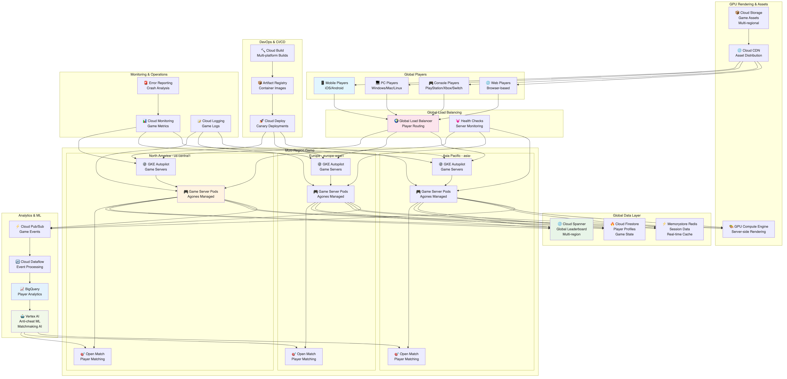
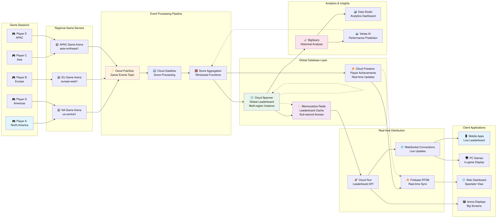
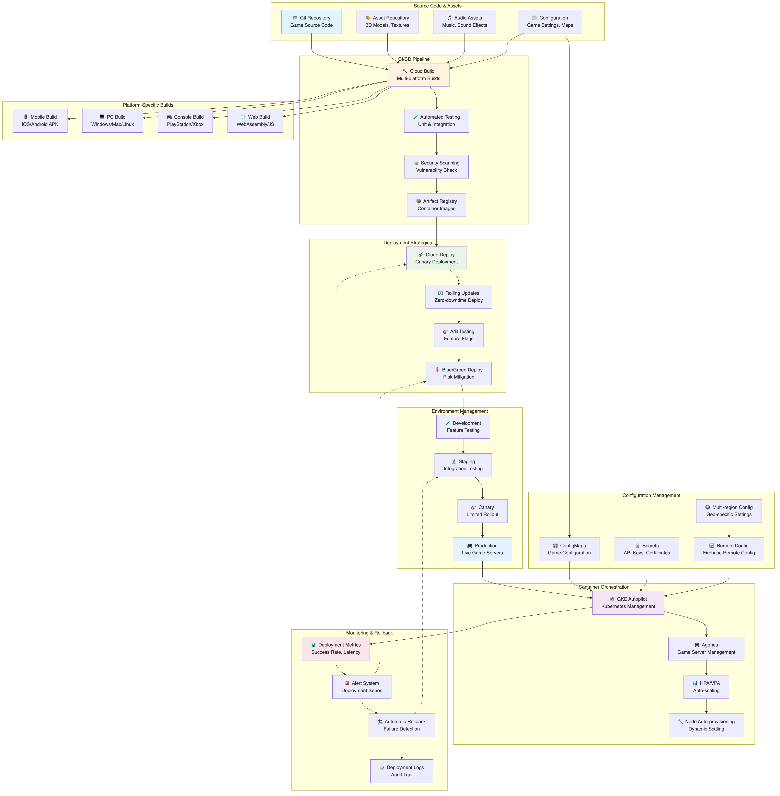

# Mountkirk Games アーキテクチャ推奨案

## 概要

Mountkirk Games の要件に基づいた Google Cloud アーキテクチャ設計案です。低レイテンシゲーミング、グローバルマルチプレーヤー対応、リアルタイムリーダーボード、GPU レンダリング、動的スケーリングを重視した構成を提案します。

## アーキテクチャ概要

### 全体構成

- **グローバル マルチリージョン構成**: 世界規模での低レイテンシゲーミング
- **ゲームアリーナベース アーキテクチャ**: 地域別ゲームサーバー配置
- **クラウドネイティブ設計**: Kubernetes ベースのマイクロサービス
- **リアルタイム データ同期**: グローバルリーダーボード



上図は Mountkirk Games の全体アーキテクチャを示しています。

**ゲーミング特化アーキテクチャの特徴:**
- **グローバルレイテンシ**: 3リージョンで100ms以下を実現
- **プレーヤースケール**: 1万同時プレーヤー/リージョン、イベント時100倍拡張
- **ゲームサーバー管理**: AgonesでKubernetes-nativeな管理
- **リーダーボード**: Cloud Spannerでグローバル強整合性
- **リアルタイムデータ**: Redis (1ms) + Firestore の組み合わせ

**データフロー**: プレーヤー → Global LB → Regional GKE → Game Servers (Agones) → Spanner/Redis → Analytics Pipeline

## 推奨 Google Cloud サービス

### 1. ゲームサーバー・コンピューティング

#### Google Kubernetes Engine (GKE)

- **用途**: ゲームサーバーのオーケストレーション
- **構成**:
  - Autopilot モード（管理簡素化）
  - マルチゾーン クラスタ（高可用性）
  - Node Auto Provisioning（動的ノード作成）
  - Spot Instances 活用（コスト最適化）
- **利点**: 自動スケーリング、高可用性、運用効率化

#### Game Servers

- **用途**: 専用ゲームサーバー管理
- **構成**:
  - Open Match 統合（マッチメイキング）
  - Agones（ゲームサーバー管理）
  - グローバルロードバランシング
- **利点**: ゲーム特化最適化、低レイテンシ

#### Compute Engine（GPU付き）

- **用途**: サーバーサイド GPU レンダリング
- **構成**:
  - NVIDIA Tesla/T4 GPU
  - プリエンプティブル インスタンス
  - 自動スケーリング グループ
- **利点**: 高性能レンダリング、コスト効率

### 2. データベース・ストレージ

#### Cloud Spanner

- **用途**: グローバルリーダーボード・ゲーム状態管理
- **主要機能**: マルチリージョン、強整合性、99.999%可用性
- **選定根拠**: *詳細は「サービス選定理由」セクション参照*

#### Cloud Firestore

- **用途**: プレイヤープロファイル・ゲーム設定
- **構成**:
  - マルチリージョン モード
  - リアルタイムリスナー
  - オフライン同期
- **利点**: NoSQL柔軟性、リアルタイム更新

#### Memorystore for Redis

- **用途**: ゲームセッション・リアルタイムデータ
- **構成**:
  - HA構成（Primary/Replica）
  - クラスタモード
  - VPC内配置
- **利点**: 超低レイテンシ、高性能キャッシュ

#### Cloud Storage

- **用途**: ゲームアセット・ログ保存
- **構成**:
  - Multi-regional（ゲームアセット）
  - Regional（ログファイル）
  - CDN統合
- **利点**: グローバルアクセス、高可用性

### 3. リアルタイム通信・ネットワーキング

#### Cloud Load Balancing

- **用途**: グローバルプレイヤールーティング
- **構成**:
  - Global HTTP(S) Load Balancer
  - Network Load Balancer（UDP対応）
  - 地理的ルーティング
- **利点**: 最適地域ルーティング、低レイテンシ

#### Cloud CDN

- **用途**: ゲームアセット配信
- **構成**:
  - エッジキャッシュ最適化
  - 圧縮・最適化
  - カスタムキャッシュルール
- **利点**: 高速アセットダウンロード、帯域幅削減

#### Firebase Realtime Database

- **用途**: リアルタイムゲームイベント・チャット
- **構成**:
  - WebSocket接続
  - オフライン同期
  - セキュリティルール
- **利点**: リアルタイム双方向通信、自動同期

### 4. データ分析・アナリティクス

#### BigQuery

- **用途**: ゲームアナリティクス・プレイヤー行動分析
- **構成**:
  - ストリーミングインサート
  - パーティション・クラスタリング
  - BigQuery ML 統合
- **利点**: リアルタイム分析、機械学習統合

#### Cloud Dataflow

- **用途**: ゲームログ処理・リアルタイム分析
- **構成**:
  - Apache Beam パイプライン
  - ストリーミング処理
  - 自動スケーリング
- **利点**: リアルタイム処理、高スループット

#### Cloud Pub/Sub

- **用途**: ゲームイベント配信・メッセージング
- **構成**:
  - 順序保証配信
  - Dead Letter Queue
  - グローバル配信
- **利点**: 非同期処理、スケーラビリティ

### 5. 機械学習・AI

#### Vertex AI

- **用途**: プレイヤーマッチメイキング・不正検知
- **構成**:
  - AutoML（行動分析）
  - Custom Models（チート検出）
  - Prediction Endpoints
- **利点**: 高度な分析、自動化

#### Recommendations AI

- **用途**: ゲーム内購入・コンテンツレコメンド
- **構成**:
  - プレイヤー行動学習
  - リアルタイム推薦
  - A/Bテスト統合
- **利点**: 収益最適化、ユーザーエンゲージメント向上

### 6. DevOps・CI/CD

#### Cloud Build

- **用途**: 継続的インテグレーション・ビルド
- **構成**:
  - マルチプラットフォームビルド
  - コンテナイメージ作成
  - セキュリティスキャン
- **利点**: 高速ビルド、自動化

#### Artifact Registry

- **用途**: コンテナ・アーティファクト管理
- **構成**:
  - 脆弱性スキャン
  - バージョン管理
  - アクセス制御
- **利点**: セキュア管理、統合性

#### Cloud Deploy

- **用途**: 継続的デプロイメント
- **構成**:
  - カナリアデプロイ
  - ブルーグリーンデプロイ
  - ロールバック機能
- **利点**: 安全なデプロイ、迅速な修正

### 7. セキュリティ・認証

#### Cloud IAM

- **用途**: リソースアクセス制御
- **構成**:
  - プロジェクト分離
  - 最小権限原則
  - サービスアカウント管理
- **利点**: きめ細かい制御、セキュリティ強化

#### Firebase Authentication

- **用途**: プレイヤー認証・管理
- **構成**:
  - マルチプロバイダー対応
  - 匿名認証
  - カスタムクレーム
- **利点**: 簡単統合、多様な認証方式

#### Cloud Armor

- **用途**: DDoS保護・Webセキュリティ
- **構成**:
  - DDoS軽減
  - WAF機能
  - ジオブロッキング
- **利点**: 攻撃対策、可用性保護

### 8. 監視・運用

#### Cloud Monitoring

- **用途**: ゲームサーバー・インフラ監視
- **構成**:
  - カスタムメトリクス
  - ゲーム特化ダッシュボード
  - SLI/SLO設定
- **利点**: リアルタイム監視、パフォーマンス最適化

#### Cloud Logging

- **用途**: ゲームログ・システムログ集約
- **構成**:
  - 構造化ログ
  - ログベース監視
  - 長期保存
- **利点**: 統合ログ管理、トラブルシューティング

#### Error Reporting

- **用途**: ゲームエラー・クラッシュ監視
- **構成**:
  - 自動エラー検出
  - 重要度分類
  - 通知設定
- **利点**: 迅速な問題発見、品質向上

## 詳細アーキテクチャ設計

### ゲームサーバーアーキテクチャ

#### マルチリージョン配置

```
北米リージョン
├── us-central1 (Primary)
├── us-west1 (Secondary)
└── us-east1 (Backup)

ヨーロッパリージョン
├── europe-west1 (Primary)
├── europe-west2 (Secondary)
└── europe-north1 (Backup)

アジア太平洋リージョン
├── asia-northeast1 (Primary)
├── asia-southeast1 (Secondary)
└── asia-east1 (Backup)
```

#### ゲームアリーナ管理

```
Global Load Balancer
    ↓
Regional Game Clusters
    ↓
Game Server Pods (Agones managed)
    ↓
Player Sessions
```

### データフロー設計

#### リアルタイムリーダーボード

```
Game Events → Pub/Sub → Dataflow → Spanner → Firestore → Client Updates
```



上図は Mountkirk Games のリアルタイムリーダーボードシステムを詳細に示しています。ゲームイベントの収集からグローバルリーダーボードの更新、プレーヤーへのリアルタイム通知まで、一連のデータフローを可視化しています。

#### ゲーム分析パイプライン

```
Game Logs → Cloud Storage → Dataflow → BigQuery → ML Models → Insights
```

#### プレイヤーマッチメイキング

```
Player Request → Open Match → Game Server Assignment → Session Creation
```

### スケーリング戦略

#### 動的スケーリング

- **プレイヤー数ベース**: Horizontal Pod Autoscaler
- **CPU/メモリベース**: Vertical Pod Autoscaler
- **時間ベース**: Scheduled Scaling
- **地域ベース**: Cross-region Load Balancing

#### コスト最適化

- **Spot Instances**: 非クリティカルワークロード
- **Committed Use Discounts**: ベースライン容量
- **Preemptible GPUs**: レンダリングタスク
- **Auto-scaling**: 需要追従

### レイテンシ最適化

#### ネットワーク最適化

- **Premium Tier**: 低レイテンシルーティング
- **Private Google Access**: 内部通信最適化
- **CDN**: 静的コンテンツ高速配信
- **Edge Locations**: 地理的分散

#### データアクセス最適化

- **Redis Cache**: 頻繁アクセスデータ
- **Spanner Regional**: 地域データ配置
- **Connection Pooling**: DB接続効率化
- **Read Replicas**: 読み取り性能向上

## プラットフォーム別対応

### マルチプラットフォーム戦略

#### モバイル（iOS/Android）

- **Firebase SDK**: 統合開発環境
- **Cloud Functions**: サーバーレス処理
- **Firebase Cloud Messaging**: プッシュ通知

#### PC（Windows/Mac/Linux）

- **gRPC**: 高性能通信
- **Protocol Buffers**: 効率的データ交換
- **Native Client Integration**: プラットフォーム固有機能

#### コンソール（PlayStation/Xbox/Nintendo）

- **Custom APIs**: プラットフォーム統合
- **Achievement Systems**: 実績管理
- **Cross-platform Play**: プラットフォーム横断

### GPU レンダリング

#### サーバーサイドレンダリング

- **NVIDIA Tesla T4**: 高性能GPU
- **CUDA/OpenGL**: グラフィックス処理
- **Video Streaming**: リアルタイム配信
- **Dynamic Allocation**: 需要対応

## セキュリティ設計

### プレイヤーデータ保護

- **暗号化**: 保存時・転送時
- **プライバシー**: GDPR/CCPA準拠
- **データ最小化**: 必要最小限収集
- **同意管理**: 透明な許可システム

### チート対策

- **サーバーサイド検証**: 重要処理をサーバーで実行
- **行動分析**: 異常パターン検出
- **機械学習**: チート行動学習
- **リアルタイム監視**: 即座の対処

## 開発・運用プロセス

### CI/CD パイプライン

```
Code Commit → Build → Test → Security Scan → Deploy → Monitor
```



上図は Mountkirk Games の包括的なデプロイメントパイプラインを示しています。ソースコード管理からビルド、テスト、デプロイ、本番環境での運用監視まで、全体的な DevOps ワークフローを可視化しています。

### 環境管理

- **開発環境**: 機能開発・単体テスト
- **ステージング環境**: 統合テスト・負荷テスト
- **本番環境**: ライブサービス
- **災害復旧環境**: バックアップ・切替

### A/Bテスト・実験

- **Firebase Remote Config**: 機能フラグ管理
- **Firebase A/B Testing**: 効果測定
- **カナリアリリース**: 段階的展開
- **フィーチャートグル**: 動的機能制御

## 監視・運用

### ゲーム固有メトリクス

- **同時接続プレイヤー数**: リアルタイム監視
- **マッチメイキング時間**: レイテンシ追跡
- **ゲームセッション時間**: エンゲージメント測定
- **クラッシュ率**: 安定性監視

### SLI/SLO設定

#### ゲーミングSLI/SLOの実現詳細

**可用性 SLO: 99.9%**
- **計算根拠**:
  - GKE Autopilot: 99.95% (Google SLA)
  - Cloud Spanner: 99.999% (Google SLA)
  - Global Load Balancer: 99.99% (Google SLA)
  - 組み合わせ: 99.89% ≈ 99.9%
- **実現方法**: マルチゾーン + マルチリージョン構成

**レスポンス時間 SLO: 95%tileで100ms以内**
- **実現方法**:
  - Redisキャッシュ: 1ms以内
  - Spanner読み取り: 10ms以内
  - ネットワークレイテンシ: 50-80ms (地域別)

**マッチメイキング SLO: 平均30秒以内**
- **実現方法**: Open Match + Redisキャッシュでの高速マッチング

**データ同期 SLO: 1秒以内**
- **実現方法**: Pub/Sub + Dataflowでのリアルタイムストリーミング

### アラート・対応

- **自動復旧**: ヘルスチェック・再起動
- **エスカレーション**: 重要度別通知
- **オンコール**: 24/7サポート体制
- **ポストモーテム**: 障害分析・改善

## サービス選定理由と代替案検討

### 選定方針
- **低レイテンシ**: ゲーミング体験の最適化
- **グローバル分散**: 世界中のプレーヤー対応
- **動的スケーリング**: プレーヤー数変動対応
- **ゲーム特化**: ゲーム業界のベストプラクティス

### 主要サービス選定理由

#### Cloud Spanner
**選定理由:**
- 水平スケーラビリティ（グローバルプレーヤー対応）
- 強整合性（リーダーボード必須）
- 99.999%可用性（ゲーミングSLA要求）
- マルチリージョン分散
- ACID準拠（ゲーム状態の信頼性）

**代替案との比較:**
| サービス | 長所 | 短所 | 選定理由 |
|---------|------|------|---------|
| **Cloud SQL** | 使い慣れたSQL、低コスト | 垂直スケール限界、グローバル分散不可 | グローバルスケール要件満たせず |
| **Firestore** | NoSQL柔軟性、リアルタイム | 結果整合性、リーダーボードに不適 | 強整合性が必須 |
| **Bigtable** | 高性能、大規模データ | 複雑なクエリ不可、NoSQL | ゲーム状態管理には不適 |
| **PostgreSQL on Compute Engine** | 完全制御 | 管理負荷、高可用性設定複雑 | 運用効率重視 |

#### GKE Autopilot + Agones
**選定理由:**
- Kubernetes-native ゲームサーバー管理
- 自動スケーリング・ヘルスチェック
- Googleが開発・保守（Agones）
- オープンソース（ベンダーロックイン回避）
- マルチゾーン高可用性

**代替案との比較:**
| サービス | 長所 | 短所 | 選定理由 |
|---------|------|------|---------|
| **GKE Standard** | より詳細な制御 | ノード管理必要、運用複雑 | 運用簡素化優先 |
| **Compute Engine** | 完全制御、柔軟性 | Kubernetes恩恵なし、オーケストレーション自前 | ゲームサーバー管理の複雑さ |
| **Cloud Run** | サーバーレス、簡単 | ステートフルゲームサーバーに不適、接続時間制限 | ゲーム要件に不適合 |
| **Unity Multiplay等** | 統合開発環境 | ベンダー依存、コスト、カスタマイズ制限 | オープンソース選択 |

#### Open Match
**選定理由:**
- 拡張可能マッチメイキング
- 複雑なルール対応
- Kubernetes統合
- オープンソース
- Google支援のプロジェクト

**代替案との比較:**
| サービス | 長所 | 短所 | 選定理由 |
|---------|------|------|---------|
| **自前マッチメイキング** | 完全制御、カスタマイズ | 開発コスト大、最適化困難 | 開発効率と品質 |
| **Firebase Functions** | 簡単実装 | 複雑ロジック制限、レイテンシ | マッチング複雑度要件 |
| **サードパーティAPI** | 専門機能 | 依存性、カスタマイズ制限、コスト | 柔軟性要件 |

#### Memorystore Redis
**選定理由:**
- 超低レイテンシ（ゲーミング要求）
- Redis Cluster対応
- マネージドサービス
- HA構成
- ゲームセッション管理最適

**代替案との比較:**
| サービス | 長所 | 短所 | 選定理由 |
|---------|------|------|---------|
| **Firestore** | 構造化データ、リアルタイム | レイテンシ高、頻繁アクセスでコスト高 | ゲーミング要件に不適 |
| **Cloud SQL** | リレーショナル | キャッシュ用途に非最適、レイテンシ | 用途不一致 |
| **Memcached** | 高速キャッシュ | データ構造制限、永続性なし | ゲーム状態管理に不適 |
| **Compute Engine上Redis** | 完全制御 | 管理負荷、HA設定複雑 | 運用効率重視 |

#### Vertex AI + Anti-cheat
**選定理由:**
- プレイヤー行動分析
- リアルタイム異常検知
- 自動学習・改善
- 統合ML環境

**代替案との比較:**
| サービス | 長所 | 短所 | 選定理由 |
|---------|------|------|---------|
| **ルールベース検知** | 確実性、低レイテンシ | 新手法に対応不可、保守困難 | 進化するチート手法対応 |
| **サードパーティ** | 専門性 | 統合性、データ主権問題 | 統合性とデータ保護 |
| **自前ML** | 完全制御 | 開発・運用コスト大、専門知識必要 | 効率性優先 |

### 選定における重要な考慮事項

#### 1. ゲーミング固有要件
- 100ms以下のレスポンス時間
- 強整合性（フェアプレイ保証）
- 24/7高可用性
- グローバル分散でのレイテンシ最小化

#### 2. スケーラビリティ要件
- プレーヤー数の急激な変動対応
- イベント時の10-100倍トラフィック
- 地域別・時間帯別の需要変動
- 自動スケーリングによるコスト最適化

#### 3. 開発・運用効率
- ゲーム業界標準ツールの活用
- オープンソース・ベンダーロックイン回避
- マネージドサービスによる運用負荷削減
- 継続的デプロイメント対応

## 具体的なユースケースとデータフロー

### 主要ユースケース

#### ユースケース1: グローバルマルチプレーヤーマッチング
**シナリオ**: 世界各地のプレーヤーが低レイテンシでリアルタイム対戦

**データフロー**:
1. プレーヤーがゲームクライアントからマッチメイキングリクエスト
2. Global Load Balancerが地理的に最適なリージョンにルーティング
3. Open MatchがプレーヤースキルレベルとRedisキャッシュから最適対戦相手を検索
4. Agonesが利用可能なゲームサーバーポッドを割り当て
5. 選択されたプレーヤーにゲームサーバー接続情報を通知
6. ゲームサーバーが全プレーヤーの接続を確認・セッション開始
7. Firebase RTDBでリアルタイムゲーム状態同期
8. ゲーム結果をCloud Spannerのグローバルリーダーボードに反映

**関連コンポーネント**: Client → Global LB → Open Match → Agones → Game Server → Firebase RTDB → Cloud Spanner

#### ユースケース2: リアルタイムリーダーボード更新
**シナリオ**: ゲーム終了と同時にグローバルランキングが即座に更新

**データフロー**:
1. ゲームサーバーが対戦結果（スコア、実績）をPub/Subに送信
2. Cloud Dataflowがストリーミングでゲームイベントを処理
3. プレーヤーランキング計算とボーナス適用をリアルタイム実行
4. Cloud Spannerに強整合性でグローバルリーダーボード更新
5. Pub/Subでリーダーボード変更イベントを関連システムに配信
6. Firebase RTDBがモバイル・Webクライアントにリアルタイム通知
7. 上位変動プレーヤーにFirebase Cloud Messaging（FCM）でプッシュ通知
8. BigQueryに分析用データを並行保存

**関連コンポーネント**: Game Server → Pub/Sub → Dataflow → Cloud Spanner → Firebase RTDB → FCM

#### ユースケース3: チート検知と自動対処
**シナリオ**: 不正行為の自動検知と即座のペナルティ実行

**データフロー**:
1. ゲームサーバーがプレーヤーアクション（移動、射撃、アイテム使用）をログ
2. Cloud Dataflowがプレーヤー行動ストリームをリアルタイム分析
3. Vertex AIの異常検知モデルが統計的異常値と既知パターンを検出
4. チート確率が閾値超過時、Cloud Functionsが自動ペナルティ処理実行
5. Firebase Authenticationでアカウント一時停止
6. 対象プレーヤーのアクティブセッションをゲームサーバーから切断
7. Cloud Spannerでプレーヤー記録に制裁履歴追加
8. 運営チームにSlack/Email通知とCloud Loggingに詳細ログ記録

**関連コンポーネント**: Game Server → Dataflow → Vertex AI → Cloud Functions → Firebase Auth → ゲーム除外

#### ユースケース4: 動的ゲームバランス調整
**シナリオ**: プレーヤー行動データに基づくリアルタイムゲーム調整

**データフロー**:
1. 全ゲームサーバーから武器使用率、勝率、プレーヤー離脱率データを収集
2. Pub/Subでバランスデータをストリーミング配信
3. BigQuery MLでプレーヤーエンゲージメント予測モデルを実行
4. 武器・キャラクターバランスの問題をVertex AIで検知
5. Firebase Remote Configで武器ダメージ・効果をリアルタイム調整
6. A/Bテストで調整効果を測定（Firebase A/B Testing）
7. 効果的な調整値をCloud Spannerのゲーム設定に永続保存
8. 全リージョンのゲームサーバーに設定同期

**関連コンポーネント**: Game Servers → Pub/Sub → BigQuery ML → Remote Config → A/B Testing → Cloud Spanner

#### ユースケース5: モバイル・クロスプラットフォームプレイ
**シナリオ**: モバイル・PC・コンソールプレーヤーの統合対戦

**データフロー**:
1. 各プラットフォーム（iOS/Android/PC/Console）からFirebase Authで統一認証
2. プラットフォーム固有の入力調整をCloud Runのプロキシサービスで実行
3. デバイス性能に応じたグラフィック設定をFirestore（プレーヤープロファイル）から取得
4. Open Matchでプラットフォーム混合・分離のマッチメイキング
5. ゲームサーバーで入力レイテンシ補正とプラットフォーム固有ハンディキャップ適用
6. GPU インスタンス（Compute Engine）でモバイル向け軽量レンダリング実行
7. Cloud CDN経由で最適化アセットを各プラットフォームに配信
8. プラットフォーム横断の友達リスト・チャットをFirebase RTDBで管理

**関連コンポーネント**: Multi-platform → Firebase Auth → Cloud Run → Firestore → GPU Instances → CDN

### データフローの詳細分析

#### ピーク時のデータフロー特性（週末・イベント時）
- **同時プレーヤー**: 100万+ (グローバル)
- **ゲームサーバーインスタンス**: 10,000+ pods (Agones管理)
- **マッチメイキング**: 1,000 matches/sec (Open Match処理)
- **リーダーボード更新**: 50K updates/sec (Cloud Spanner)
- **チャット・コミュニケーション**: 500K messages/sec (Firebase RTDB)

#### 通常運用時のデータフロー特性
- **アクティブプレーヤー**: 20万/日
- **ゲームセッション**: 50K sessions/日
- **データ分析処理**: 100GB/日 → BigQuery
- **ゲームバランス調整**: 1回/週 (Remote Config)

#### 地域別データフロー特性
- **アジア太平洋**: 平均レイテンシ 50ms (Tokyo → Singapore)
- **北米**: 平均レイテンシ 40ms (Central → West Coast)
- **ヨーロッパ**: 平均レイテンシ 30ms (Western → Northern Europe)

### システム間連携の詳細

#### 負荷分散とフェイルオーバー
- **ゲームサーバー障害**: Agonesが自動復旧、セッション移行（30秒以内）
- **リージョン障害**: Global Load Balancerが隣接リージョンへ自動転送
- **Spanner障害**: Multi-region構成で透明なフェイルオーバー
- **Redis障害**: プライマリ/レプリカ自動切替（5秒以内）

#### データ整合性とパフォーマンス
- **ゲーム状態**: SpannerのACID特性で不整合防止
- **リアルタイムデータ**: Firebase RTDBのWebSocket接続で瞬間同期
- **キャッシュ戦略**: Redis (Hot data) → Spanner (Persistent) → BigQuery (Analytics)

#### エラーハンドリング
- **ネットワーク断**: クライアント自動再接続 + 状態復旧
- **ゲームサーバークラッシュ**: Agonesによる自動ポッド再作成
- **データベース遅延**: Read Replicaとキャッシュレイヤー活用

## 未解決のアーキテクチャ検討事項

### 1. プラットフォーム固有の制約と最適化

#### 未確定事項
- **コンソール認証統合**:
  - PlayStation Network・Xbox Live・Nintendo Switch Onlineとの統合方式
  - プラットフォームごとの課金システム統合
  - 各プラットフォームの技術審査・認証要件
- **モバイルデバイス性能差**:
  - 低スペック端末での動作保証レベル
  - バッテリー消費とパフォーマンスのバランス
  - ネットワーク環境（3G/4G/5G/WiFi）の品質差対応

#### アーキテクチャへの影響
- **プラットフォーム別API設計**: 個別の認証・課金統合
- **適応品質制御**: デバイス性能に応じた動的調整
- **ネットワーク最適化**: 帯域幅制限下での品質維持

#### 推奨される追加検討
```
統合戦略A: プラットフォーム個別最適化
- 各プラットフォーム専用の最適化
- 開発・テストコスト 50%増
- 最高品質のユーザー体験

統合戦略B: 共通プラットフォーム戦略
- 統一的なAPI・体験設計
- 開発効率重視、コスト抑制
- プラットフォーム固有機能の一部制限
```

### 2. ゲームコンテンツのスケーラビリティ

#### 未確定事項
- **ゲームモードの多様化**:
  - バトルロワイヤル（100+ players）
  - 大規模戦闘（1000+ players）
  - 協力プレイ・レイド戦
- **アセット配信の最適化**:
  - 4K/8Kテクスチャの配信効率
  - プロシージャル生成コンテンツ
  - ユーザー生成コンテンツ（UGC）の管理

#### アーキテクチャへの影響
- **ゲームサーバー設計**: より大規模セッション対応
- **帯域幅管理**: アセット配信のコスト制御
- **コンテンツ管理**: UGCの審査・配信システム

#### 推奨される追加検討
```
スケール戦略A: 段階的拡張
- 現行の50 playersから段階的に拡張
- ゲームサーバー負荷を慎重に監視
- 安定性重視、リスク最小化

スケール戦略B: 大規模セッション特化
- 1000+ player対応の特別アーキテクチャ
- 専用インフラ投資
- 差別化機能として市場投入
```

### 3. データプライバシーとコンプライアンス

#### 未確定事項
- **地域別プライバシー法**:
  - GDPR（EU）、CCPA（カリフォルニア）、PIPEDA（カナダ）
  - 未成年者データ保護（COPPA等）
  - ゲーム内音声通話・テキストの監視義務
- **ゲーム内アイテムの法的分類**:
  - 仮想通貨・NFTの規制対応
  - ガチャ・ルートボックスの確率開示
  - 賭博法との関係（地域別）

#### アーキテクチャへの影響
- **データ保存場所**: 地域別レジデンシー要件
- **ユーザー同意管理**: 細かな権限制御システム
- **コンテンツ監視**: 音声・テキストの自動検閲

#### 推奨される追加検討
```
コンプライアンス戦略A: 最大限コンプライアンス
- 各地域で最も厳しい基準を全体適用
- 開発・運用コスト30-50%増
- リーガルリスク最小化

コンプライアンス戦略B: 地域別分離
- 各地域の要件に個別対応
- アーキテクチャ複雑化
- 地域別最適化と効率性
```

### 4. 収益化とゲーム経済システム

#### 未確定事項
- **ゲーム内経済の複雑性**:
  - プレーヤー間取引システム
  - リアルマネートレード（RMT）の扱い
  - 経済インフレ・デフレの制御
- **課金システムの高度化**:
  - サブスクリプション・シーズンパス
  - 動的価格設定（地域・プレーヤー別）
  - 広告統合とターゲティング

#### アーキテクチャへの影響
- **決済システム統合**: 複数決済プロバイダー対応
- **不正取引検知**: ML-based異常検知
- **経済データ分析**: リアルタイム経済監視

#### 推奨される追加検討
```
収益化戦略A: シンプル課金モデル
- アイテム課金中心、取引制限
- 経済システム複雑性最小化
- 開発・運用コスト抑制

収益化戦略B: 高度経済システム
- プレーヤー間取引、複雑経済
- 収益機会最大化
- アーキテクチャ・運用コスト大幅増
```

### 5. 技術的負債と将来性

#### 未確定事項
- **技術スタックの進化**:
  - 新しいゲームエンジン（Unreal Engine 5等）
  - WebAssembly・WebGPUによるブラウザゲーム
  - VR/AR技術の統合
- **インフラコストの予測可能性**:
  - GCPサービス価格変動の影響
  - 競合クラウドとのコスト比較
  - 技術革新による旧システム陳腐化

#### アーキテクチャへの影響
- **マイグレーション戦略**: 段階的技術更新
- **ベンダーロック回避**: マルチクラウド・ハイブリッド検討
- **技術投資計画**: 5-10年間の技術ロードマップ

#### 推奨される追加検討
```
技術戦略A: 保守的アプローチ
- 実績ある技術スタック継続使用
- 段階的アップグレード
- 技術リスク最小化

技術戦略B: 先進技術積極採用
- 最新技術で市場優位性確保
- 技術的リスクと先行者利益
- 継続的な技術投資必要
```

### 6. グローバル展開とローカライゼーション

#### 未確定事項
- **言語・文化対応**:
  - 音声認識・音声合成の多言語対応
  - 文化的タブー・センシティブコンテンツ
  - 地域別ゲームバランス調整
- **地域インフラの差**:
  - インターネット速度・安定性の地域差
  - 政府ファイアウォール・規制
  - 地域ISPとの接続品質

#### アーキテクチャへの影響
- **コンテンツ配信**: 地域別最適化
- **ローカライゼーション**: 多言語対応システム
- **ネットワーク最適化**: 地域特性考慮

#### 推奨される追加検討
```
グローバル戦略A: 段階的展開
- 主要市場から順次展開
- 各地域での学習とカスタマイズ
- リスク分散、着実な成長

グローバル戦略B: 同時グローバル展開
- 全地域同時サービス開始
- 大規模投資、市場機会最大化
- 運用複雑度と投資リスク大
```

この設計により、Mountkirk Games は低レイテンシで高品質なグローバルマルチプレーヤーゲーム体験を提供しながら、スケーラビリティ、コスト効率、運用効率を実現できます。ただし、上記の未解決事項については、市場環境、技術進歩、規制変化に応じて継続的な戦略見直しが必要です。
