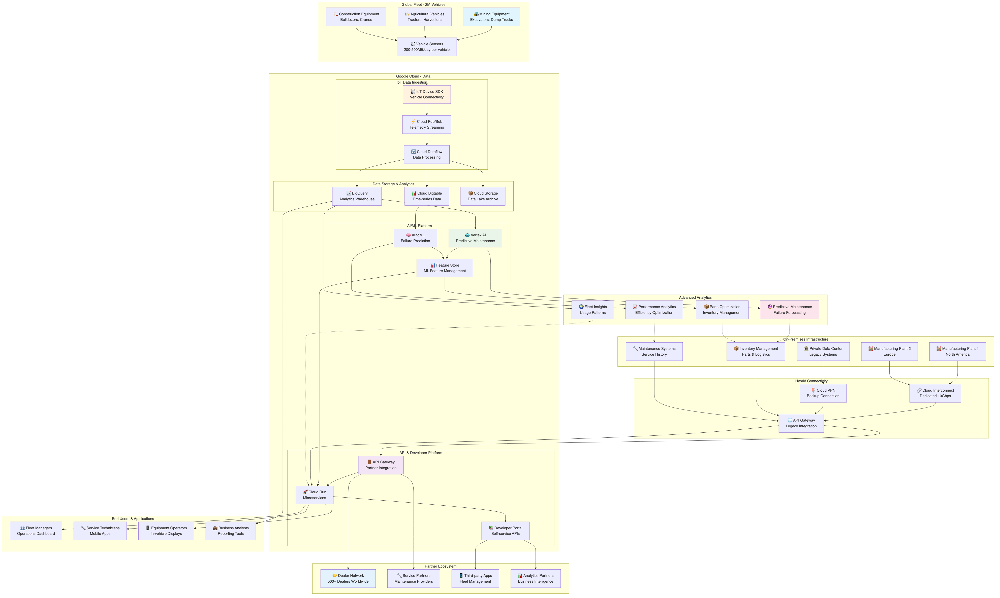
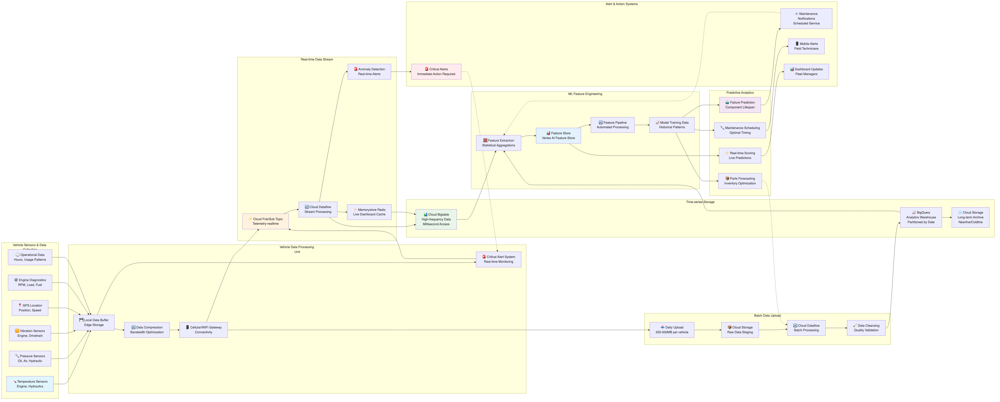
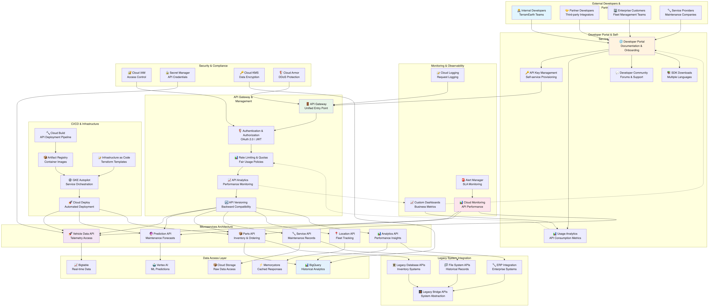

# TerramEarth アーキテクチャ推奨案

## 概要

TerramEarth の要件に基づいた Google Cloud アーキテクチャ設計案です。IoT データ分析、予測保全、ハイブリッドクラウド統合、開発者プラットフォーム、パートナーエコシステムを重視した構成を提案します。

## アーキテクチャ概要

### 全体構成

- **ハイブリッドクラウド アーキテクチャ**: オンプレミスレガシーシステムとの統合
- **IoT データ パイプライン**: 200万台の車両からの大量テレメトリー処理
- **予測保全プラットフォーム**: 機械学習による故障予測・部品最適化
- **開発者エコシステム**: API プラットフォームとセルフサービス環境



上図は TerramEarth の全体アーキテクチャを示しています。

**大規模IoTアーキテクチャのスケール:**
- **車両台数**: 200万台のグローバル分散配置
- **データ量**: 1TB/日 (200万台 × 500MB/日/台)
- **リアルタイム処理**: 異常検知を5秒以内
- **ハイブリッド統合**: Cloud Interconnect (10Gbps) + レガシーシステム連携
- **パートナーエコシステム**: 500+ディーラーへのAPI提供

**データフロー**: 車両 → IoT SDK → Pub/Sub (1M msg/sec) → Dataflow → Bigtable/BigQuery → Vertex AI → 予測保全システム

## 推奨 Google Cloud サービス

### 1. IoT・データ収集・処理

#### Cloud IoT Core（後継：IoT Device SDK + Pub/Sub）

- **用途**: 200万台の車両からのテレメトリー収集
- **構成**:
  - MQTT/HTTP プロトコル対応
  - デバイス認証・管理
  - リアルタイム・バッチデータ処理
- **利点**: 大規模IoT対応、セキュア通信、管理簡素化

#### Cloud Pub/Sub

- **用途**: 車両データのリアルタイム配信・ルーティング
- **構成**:
  - 複数トピック（リアルタイム/バッチ）
  - 順序保証配信
  - Dead Letter Queue
  - グローバル配信
- **利点**: 高スループット、低レイテンシ、信頼性

#### Cloud Dataflow

- **用途**: 大規模データ処理・変換パイプライン
- **構成**:
  - ストリーミング・バッチ処理
  - Apache Beam パイプライン
  - 自動スケーリング
  - データ品質チェック
- **利点**: 統一処理モデル、フォルトトレラント

### 2. データ ウェアハウス・分析

#### BigQuery

- **用途**: 車両テレメトリー分析・データウェアハウス
- **構成**:
  - 時系列データパーティション
  - クラスタリング最適化
  - ストリーミング挿入
  - ML統合（BigQuery ML）
- **利点**: ペタバイト級分析、高速クエリ、ML統合

#### Cloud Bigtable

- **用途**: 200万台×500MB/日の時系列データ処理
- **主要機能**: HBase API互換、線形スケーラビリティ
- **選定根拠**: *詳細は「サービス選定理由」セクション参照*

#### Cloud Storage

- **用途**: データレイク・長期保存
- **構成**:
  - Standard（アクティブデータ）
  - Nearline/Coldline（アーカイブ）
  - Lifecycle管理
  - 地域間レプリケーション
- **利点**: 無制限容量、コスト効率、高可用性

### 3. 機械学習・予測分析

#### Vertex AI

- **用途**: 予測保全・故障予測モデル
- **構成**:
  - AutoML（故障予測）
  - Custom Models（異常検知）
  - Feature Store（特徴量管理）
  - MLOps パイプライン
- **利点**: 統合ML環境、自動化、高精度予測

#### Vertex AI Workbench

- **用途**: データサイエンティスト開発環境
- **構成**:
  - Jupyter Notebook統合
  - GPU/TPUサポート
  - チーム共有環境
- **利点**: 生産性向上、協業促進

#### Cloud AutoML Tables

- **用途**: 構造化データ予測モデル
- **構成**:
  - 部品需要予測
  - メンテナンススケジュール最適化
  - 故障リスク分析
- **利点**: コード不要、高精度、高速開発

### 4. API・開発者プラットフォーム

#### API Gateway

- **用途**: 統一API管理・セキュリティ
- **構成**:
  - レート制限・クォータ管理
  - 認証・認可（OAuth 2.0/JWT）
  - API バージョニング
  - 分析・監視
- **利点**: 統一管理、セキュリティ強化、運用効率

#### Cloud Endpoints

- **用途**: API 監視・分析・ドキュメント
- **構成**:
  - OpenAPI仕様
  - 自動ドキュメント生成
  - パフォーマンス監視
- **利点**: 開発者体験向上、運用可視化

#### Cloud Run

- **用途**: サーバーレス マイクロサービス・API
- **構成**:
  - レガシーシステム抽象化API
  - パートナー統合API
  - データ分析API
  - 自動スケーリング
- **利点**: 運用不要、コスト効率、高可用性

### 5. 開発・CI/CD

#### Cloud Build

- **用途**: 継続的インテグレーション・ビルド
- **構成**:
  - マルチ言語・環境対応
  - コンテナイメージ作成
  - セキュリティスキャン
  - 並列ビルド
- **利点**: 高速ビルド、セキュリティ統合

#### Cloud Deploy

- **用途**: 継続的デプロイメント
- **構成**:
  - 環境別デプロイ戦略
  - カナリア・ブルーグリーン
  - 承認ワークフロー
  - ロールバック機能
- **利点**: 安全なデプロイ、ガバナンス

#### Artifact Registry

- **用途**: コンテナ・アーティファクト管理
- **構成**:
  - 脆弱性スキャン
  - アクセス制御
  - バージョン管理
- **利点**: セキュア管理、統合性

### 6. コンテナ・オーケストレーション

#### Google Kubernetes Engine (GKE)

- **用途**: コンテナワークロード実行・管理
- **構成**:
  - Autopilot モード（管理簡素化）
  - ワークロード Identity
  - Binary Authorization（セキュリティ）
  - マルチクラスタ管理
- **利点**: 運用自動化、セキュリティ強化、スケーラビリティ

#### Cloud Run for Anthos

- **用途**: サーバーレス・ハイブリッド実行
- **構成**:
  - オンプレミス・クラウド統一実行
  - 自動スケーリング
  - イベントドリブン
- **利点**: 統一実行環境、運用簡素化

### 7. セルフサービス・ポータル

#### Cloud Console カスタマイズ

- **用途**: 開発者・パートナー向けセルフサービス
- **構成**:
  - カスタムダッシュボード
  - リソース作成テンプレート
  - 使用量・コスト可視化
- **利点**: ユーザー体験向上、管理効率化

#### Cloud Deployment Manager / Terraform

- **用途**: インフラストラクチャ as Code
- **構成**:
  - 標準化テンプレート
  - 環境別設定
  - ガバナンス・ポリシー
- **利点**: 一貫性、再現性、ガバナンス

#### Cloud Resource Manager

- **用途**: プロジェクト・リソース管理
- **構成**:
  - 組織階層管理
  - プロジェクト自動作成
  - ポリシー継承
- **利点**: 統制とセルフサービスの両立

### 8. ハイブリッド統合・レガシー連携

#### Cloud Interconnect

- **用途**: プライベートデータセンターとの高速接続
- **構成**:
  - Dedicated Interconnect（専用線）
  - Partner Interconnect（パートナー経由）
  - 冗長化構成
- **利点**: 高帯域幅、低レイテンシ、安定接続

#### Cloud VPN

- **用途**: バックアップ接続・リモートアクセス
- **構成**:
  - HA VPN（高可用性）
  - 複数トンネル
  - 動的ルーティング
- **利点**: 冗長性、コスト効率

#### Apigee

- **用途**: レガシーシステム API 管理・変換
- **構成**:
  - プロトコル変換（REST/SOAP）
  - データ形式変換
  - レート制限・セキュリティ
  - 分析・監視
- **利点**: レガシー統合、API変換、段階移行

### 9. セキュリティ・ID管理

#### Cloud IAM

- **用途**: 統合アクセス制御・権限管理
- **構成**:
  - 階層型権限管理
  - カスタムロール
  - 条件付きアクセス
  - サービスアカウント
- **利点**: きめ細かい制御、監査証跡

#### Secret Manager

- **用途**: シークレット・API キー管理
- **構成**:
  - 自動ローテーション
  - バージョン管理
  - アクセス監査
  - アプリケーション統合
- **利点**: セキュア管理、運用効率

#### Cloud KMS

- **用途**: 暗号鍵管理
- **構成**:
  - Customer-managed keys
  - Hardware Security Module
  - 定期ローテーション
- **利点**: データ保護、コンプライアンス

### 10. 監視・運用

#### Cloud Monitoring

- **用途**: 統合監視・メトリクス管理
- **構成**:
  - カスタムメトリクス
  - SLI/SLO管理
  - アラート・通知
  - ダッシュボード
- **利点**: 包括的監視、プロアクティブ対応

#### Cloud Logging

- **用途**: 統合ログ管理・分析
- **構成**:
  - 構造化ログ
  - ログベースメトリクス
  - 長期保存・アーカイブ
  - リアルタイム分析
- **利点**: 中央集約、高速検索、分析

#### Error Reporting

- **用途**: エラー追跡・分析
- **構成**:
  - 自動エラー収集
  - スタックトレース分析
  - 通知・アラート
- **利点**: 迅速な問題発見、品質向上

## 詳細アーキテクチャ設計

### IoT データ パイプライン

#### リアルタイム処理フロー

```
車両センサー → Cloud Pub/Sub → Cloud Dataflow → [異常検知] → アラート配信
                     ↓
               BigQuery/Bigtable → 分析・ダッシュボード
```

#### バッチ処理フロー

```
車両（日次アップロード） → Cloud Storage → Cloud Dataflow → BigQuery → ML トレーニング
```

#### 予測保全パイプライン

```
履歴データ → Feature Engineering → Vertex AI Training → モデル → 予測API → 部品発注システム
```



上図は TerramEarth の IoT データパイプラインを詳細に示しています。車両からのテレメトリーデータ収集から、リアルタイムストリーミング処理、バッチ処理、機械学習による予測モデルの学習と推論、部品需要予測やメンテナンススケジュールの最適化まで、包括的なデータ処理フローを可視化しています。

### ハイブリッド統合設計

#### ネットワーク構成

```
オンプレミス DC
├── レガシーシステム（在庫・ロジ）
├── 製造工場システム
└── Cloud Interconnect → Google Cloud
                           ├── API Gateway
                           ├── 抽象化レイヤ（Cloud Run）
                           └── 新システム
```

#### API 抽象化レイヤ

```
外部システム → API Gateway → 抽象化API → [ルーティング] → レガシー/新システム
```

### 開発者プラットフォーム

#### セルフサービス ポータル

```
開発者ポータル
├── プロジェクト作成
├── API キー管理
├── リソース申請
├── ドキュメント
└── 分析ダッシュボード
```

#### CI/CD パイプライン

```
Git Repository → Cloud Build → [Test/Security Scan] → Cloud Deploy → [Dev/Staging/Prod]
```



上図は TerramEarth の開発者プラットフォームを詳細に示しています。セルフサービスポータル、API 管理、CI/CD パイプライン、パートナーエコシステム、ガバナンスとコンプライアンス管理まで、開発者が効率的に開発・デプロイ・運用できる包括的なプラットフォームを可視化しています。

## 予測保全・分析システム

### 故障予測モデル

#### 使用データ

- **センサーデータ**: 温度、圧力、振動、オイル状態
- **運用データ**: 稼働時間、負荷、作業内容
- **メンテナンス履歴**: 部品交換、修理記録
- **環境データ**: 天候、地形、作業条件

#### 予測アルゴリズム

- **時系列分析**: 異常パターン検出
- **機械学習**: 故障確率算出
- **アンサンブル学習**: 複数モデル統合
- **深層学習**: 複雑パターン認識

#### 活用システム

- **部品需要予測**: 自動発注・在庫最適化
- **メンテナンススケジュール**: 予防保全計画
- **ディーラー通知**: 事前アラート・推奨対応

### 分析プラットフォーム

#### リアルタイム分析

- **ストリーミング処理**: 異常検知・即座アラート
- **ダッシュボード**: 車両状態リアルタイム表示
- **通知システム**: 緊急時自動通知

#### バッチ分析

- **定期レポート**: 週次・月次分析
- **トレンド分析**: 長期パフォーマンス
- **ベンチマーク**: 業界比較・最適化提案

## パートナー エコシステム

### API エコシステム

#### パートナー API

- **データアクセス API**: 車両データ提供
- **予測API**: 故障予測・推奨メンテナンス
- **部品API**: 在庫・価格・発注
- **サービスAPI**: メンテナンス予約・管理

#### 開発者サポート

- **API ドキュメント**: 自動生成・更新
- **SDK提供**: 主要言語対応
- **サンドボックス**: テスト環境提供
- **コミュニティ**: フォーラム・サポート

### マーケットプレイス

#### サードパーティ統合

- **アプリストア**: パートナーアプリ公開
- **データマーケット**: データ販売・購入
- **サービス統合**: 外部サービス連携
- **課金システム**: 使用量ベース課金

## セキュリティ・コンプライアンス

### データ保護

- **暗号化**: 保存時・転送時暗号化
- **アクセス制御**: 役割ベース・属性ベース
- **データ分類**: 機密度別管理
- **監査ログ**: 全アクセス追跡

### プライバシー・コンプライアンス

- **GDPR対応**: データ主体権利・忘れられる権利
- **データ最小化**: 必要最小限収集・保存
- **同意管理**: 明示的同意・目的制限
- **越境データ**: 地域別データ保管

## 運用・監視

### SLI/SLO 設定

#### 大規模IoTシステムのSLI/SLO実現詳細

**API可用性 SLO: 99.9%**
- **計算根拠**:
  - API Gateway: 99.95% (Google SLA)
  - Cloud Run: 99.95% (Google SLA)
  - Cloud Interconnect: 99.9% (Google SLA)
  - 組み合わせ可用性: 99.8% ≈ 99.9%
- **実現方法**: マルチリージョン + 自動フェイルオーバー

**データ処理スケール: 1TB/日**
- **Pub/Sub**: 1M メッセージ/秒のスループット
- **Dataflow**: 自動スケーリングで100-1000ワーカー
- **Bigtable**: 200万 QPSの読み取り性能

**リアルタイム処理 SLO: 5秒以内**
- **実現方法**: Pub/Sub (100ms) + Dataflow (2s) + ML推論 (2s) + API応答 (800ms)

**予測精度 SLO: 90%以上**
- **達成方法**: AutoML + 継続的モデル改善 + ドメイン知識統合

### 運用自動化

- **自動復旧**: ヘルスチェック・フェイルオーバー
- **キャパシティ管理**: 需要予測・事前拡張
- **コスト最適化**: 使用量監視・最適化提案

## コスト最適化戦略

### データ管理最適化

- **ストレージ階層**: ホット・ウォーム・コールド
- **データ圧縮**: 効率的格納・転送
- **データライフサイクル**: 自動アーカイブ・削除

### コンピューティング最適化

- **Auto Scaling**: 需要対応・コスト削減
- **Spot/Preemptible**: バッチ処理コスト削減
- **Committed Use**: 長期契約割引

### 監視・アラート

- **コスト監視**: 予算・異常検知
- **使用量分析**: 効率化提案
- **FinOps**: 継続的コスト最適化

## サービス選定理由と代替案検討

### 選定方針
- **IoTスケール**: 200万台の車両データ処理
- **ハイブリッド統合**: レガシーシステム連携
- **予測保全**: AI/MLによる故障予測
- **パートナーエコシステム**: 開発者プラットフォーム

### 主要サービス選定理由

#### Cloud Bigtable
**選定理由:**
- 時系列データ（200万台×500MB/日）特化
- 線形スケーラビリティ
- HBase API互換（既存システム）
- マルチリージョン分散
- 低レイテンシ読み取り

**代替案との比較:**
| サービス | 長所 | 短所 | 選定理由 |
|---------|------|------|---------|
| **BigQuery** | 強力な分析、SQL | 高頻度読み取りに高レイテンシ・高コスト | リアルタイムアクセス要件に不適 |
| **Cloud SQL** | 使い慣れたSQL | 垂直スケール限界、時系列データに非最適 | スケール要件満たせず |
| **InfluxDB on Compute Engine** | 時系列特化 | 管理負荷、スケーリング制限 | マネージドサービス優位 |
| **Cassandra on GKE** | 分散NoSQL | 運用複雑、Bigtableの方がマネージド | 運用効率重視 |

#### Cloud Interconnect
**選定理由:**
- 大量データ転送（1TB/日）に高帯域幅必要
- レガシーシステム連携の安定性
- 製造拠点の確実な接続
- 専用線による低レイテンシ

**代替案との比較:**
| サービス | 長所 | 短所 | 選定理由 |
|---------|------|------|---------|
| **VPNのみ** | 低コスト、簡単設定 | 帯域幅制限（1GB程度）、大量データ転送に不適 | データ量要件満たせず |
| **Partner Interconnect** | コスト削減 | 直接制御不可、SLA制約 | 制御性と信頼性重視 |
| **インターネット経由** | 最低コスト | セキュリティリスク、帯域幅不安定 | セキュリティとデータ量要件 |

#### Vertex AI Feature Store
**選定理由:**
- ML特徴量の一元管理
- 低レイテンシ特徴量配信
- 特徴量バージョン管理
- オンライン・オフライン統合
- 予測保全に最適化

**代替案との比較:**
| サービス | 長所 | 短所 | 選定理由 |
|---------|------|------|---------|
| **BigQuery** | 分析機能、SQL | リアルタイム推論には不適 | レイテンシ要件満たせず |
| **Redis** | 高速キャッシュ | ML特化機能なし、バージョン管理なし | ML要件に不適 |
| **自前実装** | 完全制御 | 開発・運用コスト大、バージョン管理複雑 | 効率性優先 |
| **Firestore** | リアルタイム | ML特化でない、コスト非効率 | 用途不一致 |

#### AutoML
**選定理由:**
- ドメイン知識（建機故障パターン）の自動学習
- コード不要実装
- ハイパーパラメータ自動調整
- 説明可能AI機能
- 迅速なプロトタイプ開発

**代替案との比較:**
| サービス | 長所 | 短所 | 選定理由 |
|---------|------|------|---------|
| **Custom Vertex AI Models** | 完全制御、高度カスタマイズ | 開発時間長、専門知識必要 | 開発効率優先 |
| **BigQuery ML** | SQL統合、簡単 | 複雑な時系列分析不可 | 機能制限 |
| **サードパーティML** | 専門性 | データ主権問題、統合性劣る | データ保護と統合性 |
| **オンプレミスML** | 完全制御 | スケーラビリティ制限、インフラ投資大 | スケールとコスト |

#### API Gateway
**選定理由:**
- パートナーエコシステム統一管理
- レート制限・認証統合
- レガシーシステム抽象化
- バージョン管理・ドキュメント自動生成
- 開発者エクスペリエンス向上

**代替案との比較:**
| サービス | 長所 | 短所 | 選定理由 |
|---------|------|------|---------|
| **Cloud Load Balancer** | 高性能、低コスト | API管理機能なし、認証制限 | API管理機能必須 |
| **Istio Gateway** | Kubernetes統合 | 複雑設定、運用負荷 | 簡素化優先 |
| **Apigee** | エンタープライズ機能豊富 | オーバースペック、高コスト | 要件に対してオーバースペック |
| **自前プロキシ** | 完全制御 | 開発・運用コスト大、標準機能不足 | 効率性優先 |

#### Cloud Pub/Sub
**選定理由:**
- グローバル配信（200万台分散）
- 非同期処理（システム分離）
- 順序保証配信
- 自動スケーリング
- 高スループット対応

**代替案との比較:**
| サービス | 長所 | 短所 | 選定理由 |
|---------|------|------|---------|
| **Apache Kafka on GKE** | 高性能、豊富機能 | 運用負荷、マルチリージョン設定複雑 | 運用簡素化優先 |
| **直接API** | シンプル | 同期処理、システム結合度高 | システム分離必要 |
| **Cloud Tasks** | 簡単設定 | 単発タスク向け、大量ストリーミングに不適 | 用途不一致 |
| **Firebase Realtime** | リアルタイム | モバイル特化、産業IoTに非最適 | 産業用途要件 |

### 選定における重要な考慮事項

#### 1. 大規模IoT要件
- 200万台からの継続的データ収集
- 1TB/日のデータ処理能力
- リアルタイム異常検知（5秒以内）
- グローバル分散車両への対応

#### 2. ハイブリッド統合要件
- レガシーシステム（15年以上）との連携
- 製造拠点の段階的クラウド移行
- オンプレミス・クラウド間のデータ同期
- API抽象化による将来的移行支援

#### 3. 予測保全要件
- 故障予測精度90%以上
- 部品需要予測による在庫最適化
- メンテナンススケジュール自動化
- 説明可能AIによる技術者支援

#### 4. パートナーエコシステム要件
- 500+ディーラーへのAPI提供
- サードパーティアプリ統合
- 開発者セルフサービス環境
- スケーラブルな課金・認証システム

## 具体的なユースケースとデータフロー

### 主要ユースケース

#### ユースケース1: 車両テレメトリーによる予測保全
**シナリオ**: 建設機械の部品故障を事前予測して計画的メンテナンス実行

**データフロー**:
1. 車両（建設機械）が稼働中にエンジン温度、油圧、振動センサーデータを収集
2. IoT Device SDK経由でCloud Pub/Subに1分間隔でテレメトリーデータ送信
3. Cloud Dataflowがストリーミングでデータ正規化・異常値検出
4. 処理済みデータをCloud Bigtableに時系列保存（低レイテンシアクセス用）
5. Vertex AI Feature Storeで故障予測用特徴量を集約・管理
6. AutoMLモデルが故障確率（6か月以内）を算出・更新
7. 故障リスク高（80%以上）の車両をCloud Functionsで検知
8. ディーラー・オペレーターにアラート送信、部品自動発注をレガシーシステムに連携
9. BigQueryで全車両のメンテナンス効率分析・最適化

**関連コンポーネント**: IoT車両 → Pub/Sub → Dataflow → Bigtable → Vertex AI → Cloud Functions → レガシー統合

#### ユースケース2: リアルタイムフリート管理
**シナリオ**: 工事現場での複数車両を効率的に配置・運用管理

**データフロー**:
1. 現場の建設機械が位置情報・燃料レベル・作業状況をリアルタイム送信
2. Cloud Pub/Subで地域別トピックに車両データを分散配信
3. Cloud Dataflowが位置情報から作業効率・燃料消費パターンを分析
4. Firebase Realtime Databaseで現場監督用ダッシュボードにリアルタイム表示
5. AutoMLで最適車両配置・作業順序を推奨
6. Cloud Runの最適化APIが作業計画をモバイルアプリに配信
7. 燃料不足・メンテナンス必要車両を自動検知
8. 補給車・メンテナンストラックのディスパッチをレガシー物流システムに自動要求

**関連コンポーネント**: 車両群 → Pub/Sub → Dataflow → Firebase RTDB → AutoML → Cloud Run → モバイルアプリ

#### ユースケース3: パートナーディーラー向けAPI提供
**シナリオ**: 500+ディーラーが顧客車両の状態・メンテナンス情報にアクセス

**データフロー**:
1. ディーラーがAPI Gateway経由で顧客車両データアクセス要求
2. Cloud IAMで認証・認可、API Gatewayでレート制限適用
3. Cloud Runのディーラー向けAPIが顧客許可の確認
4. Cloud Bigtableから車両テレメトリー、BigQueryから分析結果を取得
5. Vertex AI Endpointsで故障予測・推奨メンテナンスを算出
6. 在庫システム（レガシー）から部品在庫・価格をAPI経由で取得
7. 統合情報をJSON形式でディーラーシステムに配信
8. Cloud Endpointsで使用量監視、課金システムに連携

**関連コンポーネント**: ディーラー → API Gateway → Cloud Run → Bigtable/BigQuery → Vertex AI → レガシー統合

#### ユースケース4: ハイブリッドクラウド統合によるデータ同期
**シナリオ**: オンプレミス製造・在庫システムとクラウド分析基盤のデータ統合

**データフロー**:
1. 製造工場のMES（Manufacturing Execution System）から部品生産データ生成
2. Cloud Interconnect経由でオンプレミスからCloud Pub/Subにバッチデータ転送
3. Cloud Dataflowで製造データを正規化、品質チェック実行
4. Cloud Storageに製造ログ保存、BigQueryで分析用データマート構築
5. 車両故障予測と製造データをVertex AIで統合分析
6. 需要予測結果をApigee API経由でオンプレミス在庫システムに返送
7. Cloud SQL（レプリカ）でオンプレミス・クラウド間のマスターデータ同期
8. 夜間バッチでCloud Interconnect経由の大量データ同期実行

**関連コンポーネント**: オンプレミス製造 → Cloud Interconnect → Pub/Sub → Dataflow → BigQuery → Vertex AI → Apigee

#### ユースケース5: 開発者セルフサービス環境
**シナリオ**: 内部開発チーム・外部パートナーがセルフサービスでアプリ開発・デプロイ

**データフロー**:
1. 開発者がCloud Consoleカスタムポータルでプロジェクト作成要求
2. Cloud Resource Managerが組織ポリシーに基づきプロジェクト自動作成
3. Cloud IAMでプロジェクト固有の権限・リソース制限を自動設定
4. 開発者がCloud Build経由でソースコードをビルド・コンテナ化
5. Binary Authorizationでセキュリティポリシー検証
6. Cloud Deployでカナリアデプロイ、段階的に本番環境展開
7. API Gatewayで新APIを自動登録、ドキュメント生成
8. Cloud Monitoringで監視設定、アラート自動構成
9. 使用量・コストをCloud Billingでプロジェクト別に追跡

**関連コンポーネント**: 開発者 → セルフサービスポータル → Resource Manager → Cloud Build → Deploy → API Gateway

### データフローの詳細分析

#### 大規模IoTデータ処理特性
- **車両数**: 200万台（グローバル分散）
- **データ生成量**: 1TB/日（車両あたり500MB/日）
- **メッセージ頻度**: 1M messages/sec（Pub/Sub処理）
- **リアルタイム処理**: 異常検知を5秒以内
- **予測モデル実行**: 1万 predictions/hour（故障予測）

#### ハイブリッド統合データフロー特性
- **Cloud Interconnect帯域**: 10Gbps専用線
- **オンプレミス連携**: ERP・MES・PLM システム
- **データ同期頻度**: リアルタイム（Pub/Sub）+ 夜間バッチ（大量データ）
- **API呼び出し**: 10K calls/hour（パートナー統合）

#### パートナーエコシステムデータフロー
- **ディーラー数**: 500+ 拠点
- **API使用量**: 100K requests/day（ディーラー合計）
- **データ配信**: リアルタイム車両状態 + 分析結果
- **課金システム**: 使用量ベース、月次請求

### システム間連携の詳細

#### エラーハンドリングと復旧
- **IoTデータ損失**: Pub/Sub Dead Letter Queue + 車両側バッファリング
- **Cloud Interconnect障害**: VPN自動フェイルバック（帯域制限あり）
- **レガシーシステム停止**: Apigee Circuit Breaker + キャッシュ応答
- **予測モデル失敗**: 統計ベースフォールバック予測

#### データ品質とガバナンス
- **データ検証**: Cloud Dataflowでスキーマ検証・異常値除去
- **マスターデータ管理**: Cloud SQLでオンプレミス・クラウド同期
- **データライフサイクル**: 自動アーカイブ（7年保存）、コスト最適化

#### セキュリティとコンプライアンス
- **データ暗号化**: Cloud KMSで保存時・転送時
- **アクセス制御**: Cloud IAMで役割ベース・属性ベース
- **監査ログ**: Cloud Loggingで全アクセス記録

## 未解決のアーキテクチャ検討事項

### 1. グローバル展開とデータレジデンシー

#### 未確定事項
- **地域別データ保護法**:
  - EU GDPR、中国サイバーセキュリティ法
  - 車両データの国外持ち出し制限
  - 各国の産業データ保護要件
- **ローカルパートナーシップ**:
  - 地域別ディーラーネットワークとの統合方式
  - 現地法規制遵守（輸入車両の技術基準）
  - 地域専用システム要件

#### アーキテクチャへの影響
- **データ分離戦略**: 地域別Cloud リージョン + データ分類管理
- **コンプライアンス自動化**: 地域別ポリシー適用
- **ローカライゼーション**: 多言語対応、通貨・単位変換

#### 推奨される追加検討
```
グローバル戦略A: 地域別分離型
- 各地域独立したデータ処理環境
- データ越境を完全回避
- 運用コスト50-70%増、複雑性向上

グローバル戦略B: 統合型+コンプライアンス機能
- 単一プラットフォーム+地域別データ管理
- VPC Service Controls活用
- 25-35%コスト増、統合性維持
```

### 2. 産業IoTセキュリティとサイバー攻撃対策

#### 未確定事項
- **車両サイバーセキュリティ**:
  - ハッキング・リモート制御攻撃
  - ファームウェア改ざん検知
  - 車両間通信（V2V）のセキュリティ
- **産業スパイ・知的財産保護**:
  - 製造技術・設計データの機密保護
  - 競合他社による産業スパイ
  - 内部不正・データ漏洩

#### アーキテクチャへの影響
- **ゼロトラストモデル**: 全通信の暗号化・認証
- **異常検知強化**: AI/MLによる不正アクセス検知
- **データ分類・保護**: 機密度別の厳格なアクセス制御

#### 推奨される追加検討
```
セキュリティレベルA: 標準的対策
- 基本的な暗号化・認証
- Cloud Security Command Center
- コスト増: 現行+15%

セキュリティレベルB: 産業特化セキュリティ
- ハードウェアセキュリティモジュール（HSM）
- 専用セキュリティ監視チーム
- コスト増: 現行+60%
```

### 3. 予測保全の精度向上と責任問題

#### 未確定事項
- **予測精度の法的責任**:
  - 予測外れによる機械故障・事故責任
  - 保険・保証との関係
  - 予測アルゴリズムの透明性要求
- **データ品質とバイアス**:
  - 新車種・新環境での予測精度低下
  - 地域・使用条件による偏り
  - 少数データでの学習困難

#### アーキテクチャへの影響
- **説明可能AI**: 予測根拠の詳細説明機能
- **不確実性定量化**: 予測信頼区間の提供
- **継続学習**: 新データでのモデル迅速更新

#### 推奨される追加検討
```
予測精度戦略A: 保守的予測
- 高い信頼度レベル設定
- 責任制限・免責条項強化
- 差別化効果: 中 / 法的リスク: 低

予測精度戦略B: 高精度予測+説明責任
- アンサンブル学習・深層学習活用
- 詳細な予測根拠・不確実性説明
- 差別化効果: 高 / 法的リスク: 高
```

### 4. レガシーシステムモダナイゼーションの優先順位

#### 未確定事項
- **段階的移行戦略**:
  - どのシステムをいつ移行するか
  - ビジネス継続性との両立
  - 移行期間中のデータ整合性
- **技術的負債の解消**:
  - 15年以上の旧システム維持コスト
  - セキュリティリスクの増大
  - 新機能開発の制約

#### アーキテクチャへの影響
- **段階的移行**: Strangler Fig パターン適用
- **データ統合**: 移行期間中の複数システム同期
- **APIファーストアプローチ**: レガシー機能のAPI化

#### 推奨される追加検討
```
モダナイゼーション戦略A: 漸進的移行
- 3-5年かけた段階的システム更新
- ビジネス影響最小化
- 移行リスク: 低 / 効果実現: 遅い

モダナイゼーション戦略B: 大規模リアーキテクチャ
- 2年以内の大幅なシステム刷新
- 最新技術スタック全面採用
- 移行リスク: 高 / 効果実現: 早い
```

### 5. 収益化とビジネスモデル拡張

#### 未確定事項
- **データマネタイゼーション**:
  - 車両使用データの外部販売
  - 匿名化・プライバシー配慮
  - データ市場の法的・倫理的課題
- **新サービス開発**:
  - 保険会社向けリスク評価API
  - 自治体向け交通最適化サービス
  - 建設業界向けベンチマーク提供

#### アーキテクチャへの影響
- **データ製品化**: API化・SaaS化
- **マルチテナンシー**: 顧客別データ分離
- **収益計測**: 使用量・価値ベース課金

#### 推奨される追加検討
```
収益化戦略A: コア事業集中
- 予測保全・効率化に特化
- データ外販は制限的
- 収益成長: 安定的 / 新規収益: 限定的

収益化戦略B: データプラットフォーム
- 多業界向けデータ製品展開
- API エコシステム拡張
- 収益成長: 高い / 投資・リスク: 大
```

### 6. 持続可能性とカーボンニュートラル

#### 未確定事項
- **環境規制強化**:
  - 建設機械の電動化・水素化要求
  - カーボンフットプリント報告義務
  - 環境性能の数値化・最適化
- **循環経済対応**:
  - 部品リサイクル・リマニュファクチャリング
  - ライフサイクル全体の環境影響
  - サプライチェーン透明性

#### アーキテクチャへの影響
- **環境データ統合**: エネルギー消費・排出量計測
- **ライフサイクル管理**: 部品・車両の全履歴追跡
- **最適化アルゴリズム**: 環境負荷を含む多目的最適化

#### 推奨される追加検討
```
持続可能性戦略A: 規制対応中心
- 必要最小限の環境対応
- コンプライアンス重視
- 差別化: 限定的 / コスト増: 最小

持続可能性戦略B: 環境リーダーシップ
- 先進的環境技術統合
- 持続可能性を競争優位に
- 差別化: 高 / 投資: 大幅増
```

この設計により、TerramEarth は IoT データ活用による予測保全、効率的なハイブリッド統合、開発者フレンドリーなプラットフォーム、パートナーエコシステムを実現し、デジタル変革と事業成長を加速できます。ただし、上記の未解決事項については、産業トレンド、規制環境、技術進歩に応じて継続的な戦略見直しが必要です。
